# **Apuntes Semana 1**

## **Clase 1**

*Presentancion de la materia Programación II.* :)

* Presentación del profesor.

* Presentación de los estudiantes.

* Información de varios recurso que se necesitaran para los talleres.

* El primer taller en grupo se trataba de armar una torre lo mas alta y con la menor cantidad de material posible (spoiler: no salio muy bien que se diga :p).

* Explicación de como iban a ser la evalucación.

* Las pruebas y la duración de las mismas, las pruebas serian de dos horas, en cambio los examenes de ocho horas.

* El proyecto, se deberia de entregar la primera parte en el primer bimestre y la finalizacion del mismo en el segundo bimestre.

* Cuadro de evaluaciones y sus porcentajes:

|  Evaluación |   Puntaje |          |   |  Bonos Extras |  Puntaje    |
|-------------|-----------|----------|---|---------------|-------------|
| -Prueba     |   25%     |          |   |-Actuación     |  +0.1 punto |
| -Examen     |   25%     |          |   |-Retos         |  +1.0 punto |
| -Workshop   |   10%     |          |   |               |             |
| -Homework   |   10%     |          |   |               |             |
| -Proyecto   |   30%     |          |   |               |             |

* Explicación de como se iba a llevar el curso, las aplicaciones que se deberan de instalar y como conseguir una buena optimización, ademas de la personalizacion de las mismas, haciendo que sean mas comodas para sacarles el maximo provecho al momento de trabajar y tener buenos resultados.

* Presentar los apuntes de markdonw al final de cada bimestre.

* Talleres en grupo.

* Proyecto en grupo, el proyecto debe tener un aparato externo.

* Presentanción de la normativa.

* Personalizacion de las aplicaciones de trabajo.

* Aprender los comandos.

## **Clase 2**

*Personalización* *del* *Visual* *Code* *y* *de* *Git* *bash*

* Para la personalización del Git Bash y del visual code, se puede personalizar su terminal para que esta sea la determinada en Visual Code y salga por defecto automaticamente, cada vez que se le llame con el comando CTRL + Ñ o manualmente.


Ademas se puede personalizar el git bash en si con la ayuda de otras aplicaciones externas, como por ejemplo: *Oh my posh* que es una de varias que pueden ayudar a darle un toque mas personal a la terminal y la consola de Git bash, con varios diseños y fuentes de se pueden instalar facilmente.


Esos son algunos de los diseños que se pueden conseguir en Oh my posh, de la misma forma la aplicacion permite crear un diseño nuevo, al final de la personalizacion se puede obtener un resultado asi en la terminal.


* De la misma forma se puede personalizar, el color de visual estudio con ayuda de los temas que vienen en la aplicación, pero tambien se pueden instalar otros, así mismo con los iconos de las aplicaciones o archivos que se abran dentro del visual.

* Tambien es recomendable cambiar la letra del visual code y de git bash para que sea mas comoda al momento de trabajar, pero eligiendo una que sea entendible y que facilite el trabajo.

Con todo eso listo, se puede tener una buena herramienta, que sea comoda y al gusto del usuario para trabajar adecuadamente.

*Comandos* :)

* **Windows**
    * CTRL + SHIFT + P: para abrir la barra de comandos donde estan las aplicaciones y funciones.
    * CTRL + P: para ver los documentos que se han abierto recientemente o buscar algun archivo para abrirlo.
    * CTRL + B: para aparecer y desaparecer la barra donde se observan las carpetas y documentos que estabn abiertos o almacenados.
    * CTRL + D: para selecionar varias lineas.
    * CTRL + S: para guardar.
    * CTRL + Ñ: para aparecer y desaparecer la terminal.
    * SHIFT + ALT + UP/DOWN: para copiar y pegar una linea del codigo.
    * ALT + ->: Para moverse entre los archivos que se encuentran abiertos en la barra de arriba.
    * ALT + ->(arriba): Para mover una linea del codigo ya sea arriba o abajo.
    * SHIFT + ALT + A: para poner una linea de comentario.
    * SHIFT + ALT: para selencionar la linea o palabra.

* **Linux**
    * pwd: para sar en que carpeta actual te encuentras.
    * touch: para crear un nuevo archivo de cualquier tipo.
    * code: para abrir el documento creado.
    * ls: lista de archivos en el directorio.
	* clear: limpiar consola.

## **Clase 3**

*Uso* *del *Markdonw*

Markdown es una herramienta para tomar apuntes sin necesidad de una herramienta fuera del area de trabajo, visula code, este se puede descargar como un archivo en formato PDF para compartir.
Para eso se necesitan algunas extensiones.

* Titulo: #Titulo.

    Mientras mas # tenga se ira diviendo en titulos y subtitulo.

* Cursiva: * *Cursiva* *

    Con solo un * a cada lado de la palabra u oración.

* Negrillas: ** **Negrillas** **

    Con dos ** a cada lado de la palabra u oración.

* Negrilla y Cursiva: *** ***Negrilla y Cursiva*** ***

    Con tres *** a cada lado de la palabra u oración.

* Link de pagina o sitio web: [Nombre del link](Enlace del link)

    [Youtube](https://www.youtube.com/)

* Imagen: 


* Codigo: ``` Nombre del lenguaje de programacion

    (y cierra en una siguente linea) ```

    Tres ` para formar el cuadro y el nombre del lenguaja para que asi se resalte el codigo de acorde al mismo.

```c++
#include <iostream>a
#include <cstdlib>
using namespace std;
struct nodo{
    int nro;
    struct nodo *izq, *der;
};
```

* Cuadros: se puede formar cuadros dividiendo las columnas con | y la primera fila (titulos del cuadro) con ---

|  titulo 1   | titulo 2   |
|-------------|------------|
| ejemplo 1   | ejemplo 2  |
| ejemplo 1   | ejemplo 2  |

* Comando:
    * CTRL + SHIFT + V: para ver la vista previa de markdown.

*Manejo* *de git/github*

* **GIT**
    * git init: crear un nuevo repositorio.
    * git status: ver como se encuentran los archivos creados, si estan dentro de git o no.
    * git add . : añadir todos los archivos de la lista que se presente tras el *git status*.
    * git push: para subir a la nube.
    * git pull: para bajar de la nube los cambios efectuados.
    * git clone: para clorar un repositorio.
    * git commit: para guardar en la nube.

* Subir los archivos a la nube.

* Crear un repositorio en GitHub.

* Crear una carpeta en archivos en la cual clonar el repositorio del Github.

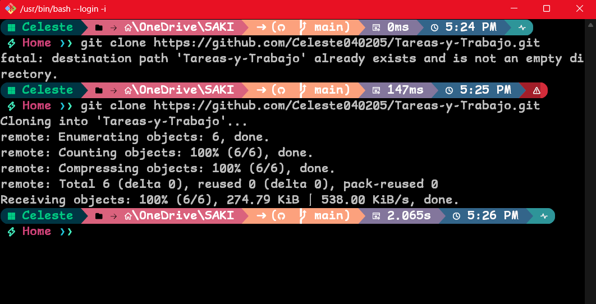

* Entonces se clonara en una nueva carpeta, con el nombre del repositorio.

* En esa carpeta se podra almacenar los documentos para subir en la nube.

* Una vez efectudos los cambios y demas, poner *git status* para comprobar como estan los cambios y *git add .* para agregar todos los cambios, comprobar con *git status* para ver todo en orden.

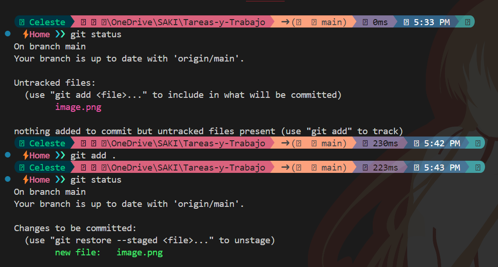

* y entonces con el comando de git commit insertar, los cambios.

*Resumen* *del trabajo*

Clonar y subir cambios a la nube
Crean una carpeta en la cual se va a clonar el proyecto y dan click derecho "git bash here"
* GitBash
    * git clone "link del repositorio".

* VsCode
    * Ctrl + Ñ: abrir terminal
    * git status
    * git add
    * git commit -m "cualquier nombre random" (cambios)
    * git remote -v: verificar si está sincronizada con el repositorio
    * git push origin main: subir el archivo.
    * git log: comprobar.

# **Apuntes Semana 2**

## **Clase 4**
*Programacion orientada a objetos*

* Java
	* Nace por problemas con el compilador, por las diferencias entre un sisitema y otro.
	* Ayuda a la distribucion del los codigos complentando los codigos del compilador.

* Funcionamiento:
	* codigo
	* compilacion
	* bytecode
	* JVM
	* Multiplataforma

*Tipos de lenguaje*

* Compilador:

	No ejecuta el programa si tiene el minimo error, proceso de compilacion que se presenta en el "trabajo" solo se tiene consola no el *F5*.

* Interprete:
 
	Es mas permisivo y lee el codigo, se detiene al encontrar un error.


*Tipos de Java*

Se tienen varios.


*Estructura del lenguaje*

* *package*: conjunto de librerias.

* *import*: escoger una libreria.

* ***: para traer, pero es mejor traer de forma mas especifica para no cargar demaciado el sistema.

* *class*: usa clases para ejecutar el codigo,debe estar en minusculas.

* *string*: tipos 

* *public static void main*: aprender debe estar alli.

*Ejemplo*


*Diferencias*

Existen varias diferencias entre las estrucutras y Progamacion orientada a objetos (O.O) de como funcionaba en C++ y como funciona ahora en Java.

|Estrucutra        |O.O              |
|------------------|-----------------|
|include (libreria)|import (paquetes)|
|funciones         |metodos          |
|struct            |clases           |
|variables         |propiedades      |

* Propiedades:
	* Ambito: public(+), private(-), protec, friendly. (si se olvida de colocar esto el programa solo se pone en privado, en pocos casos en publico)  
		
		en URL tienen simbolos.

	* Tipo de dato: 	int, char.
	* Nombre

* Metodos:
Las variables si existen solo que se ecuentran dentro de los metodos, no se puede tener fuera de estos *si se tiene fuera se convierten en propiedad*.
	* Metodo que retorne valor.
	* Metodo sin retorno (void).

*Diferencia entre punteros*
*En almacenamiento es lo mismo, pero al referirse en C es mas complicado que en Java, en c se puede darña facilmente y se debe gestionar "manualmente" los punteros, mientras que en Java esto se realiza de forma automatica, ya no es necesario todo el procedimiento que se da en C, basicamente Java facilita el proceso.*

Se pueden utlizar diagramas de flujo y el URL.

NO OLVIDAR EL PUNTO Y COMA (;) :v

*Aplicaciones*

Java gana en aplicaciones industriales.

*Diagrama de flujo*

Es importante la ilustracion de digramas de flujo para ver de forma grafica el codigo.

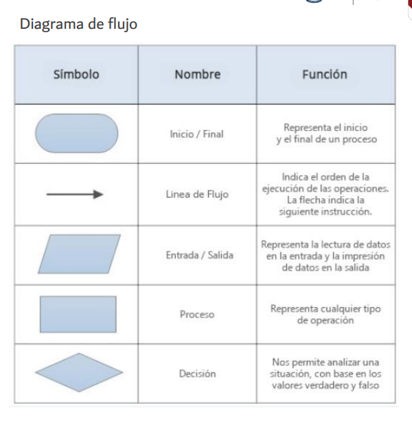

*TRACE*

Pseudocodigo.
Pruebas de escritorio, seguimiento a la corrida de un programa.
Automatizar el TRACE.

* Errores: el como esta escrito, mayusculas, minusculas, etc. Todo eso afecta.

* Forma correcta:


* For incorrecta:
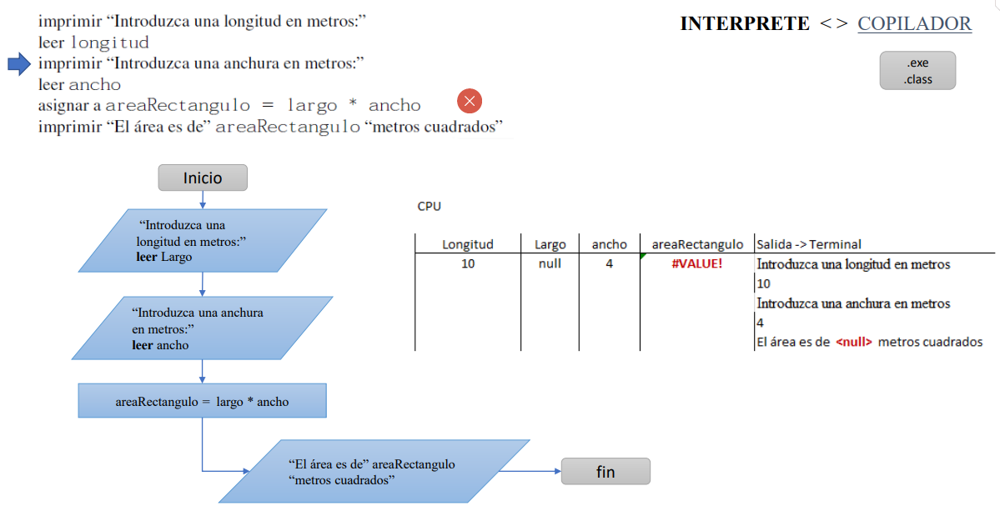

*Primer Codigo*

SHIFT + CNTRL + P

Poner un entorno base, en blanco, nuevo.

* pide que guardes en una carpeta.

Nombre: Proyecto 1.

* src: codigo fuente.

```java
public class Hi {
	//propiedades aqui afuera.
	public static void main(String[] args){
		//metodos, funciones.
		int n = 10;
		for( int i = 0; i < n; i++){
			System.out.println(i);
		}
	}
	}
```
* Compilar y Ejecutar desde consola:
pwd: donde se encuentra.
compilar: javac *Nombre del archivo*
Ejecutar: *Nombre del archivo*

*COMO FUNCIONA UN for*

```java
int n = 1O;
for( int i = 0; i < n; i++)
	System.out.println(i);
```

(int i = 0): se puede poner fuera, se pone dentro para ahorrar una linea.
(i < n): se puede cambiar a true or false 
TRUE: acepta el codigo, condicion.
FALSE: NO FUNCIONA, es como decir que no es real o falso lo que dice, entonces el codigo dice: "para que pones si es falso? :v".
(i++/i--): para que sume o reste.

*for para que comience en 2 y se aumente de 2 en 2*

```java
int n = 1O;
for( int i = 2; i < n; i+=2)
	System.out.println(i);
```

(i+=2): forma abreviada para aumentar ya no solo de 1 en 1, sino mas.
(i=i+2): forma no abreviada.

*CONDICIONAL (if)*

```java
int n = 1O;
for( int i = 0; i < n; i++)
	if (i = 6)
		System.out.println("hay un sesis");
	else 
		System.out.println(i);
```

cuando toque en el numero 6 en la ejecución, en lugar de salir "6" saldra "hay un seis".

(else): es parte de la misma instrucción del if.

```java
public class Hi {
	//propiedades aqui afuera.
	public static void main(String[] args){
		//metodos, funciones.
		int n = 10;
		for( int i = 2; i < n; i+=2){
			if (i = 6)
				System.out.println("hay un seis");
			else 
				System.out.println(i);
		}
	}
	}
```

codigo mas compacto con **OPERADOR TERNARIO**

```java
public class Hi {
	//propiedades aqui afuera.
	public static void main(String[] args){
		//metodos, funciones.
		int n = 10;
		for( int i = 2; i < n; i+=2){
			System.out.println("hay un seis");
		}
	}
	}
```
(terminar de poner el codigo compacto xd)

## **Clase 5**

### *Bucles*

*For*

Da un inicio y un final.

* creacion de documentos 

* pretty format (instalar) no se ve donde se cierra los corchetes instalar extension.

* instansacion: bf = New Buclefor() (crear o dar vida xd, )

* exencion power mod 

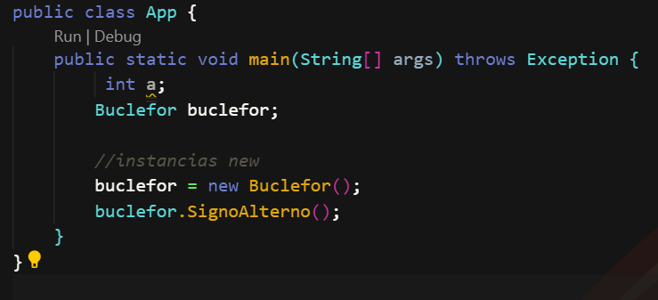

Revison de errores que pueden suceder en la plataforma para no compile.

## **Clase 6**

*Bucles for parte 2*

* Orden del directorio.

* Proyectos pequeños en distintas carpetas.

* Crear un numero proyecto.

* primero se debe saber cual sera el resultado del codigo para poder trabajar.

al momento de crear un nuevo proyecto se abrira una nueva perte de java donde esta guardado y se tiene un "src" una fuente y un *App* que ayudara a la compilar.

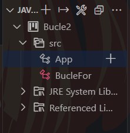

A partir de esta carpeta se puede abrir un nuevo archivo que puede ser de varios tipos.

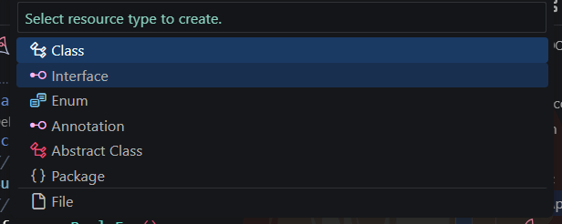

En este ocacion se selecciono *Class* y se le coloco el nombre *BucleFor* (las mayusculas son importantes) se comenzo a trabajar en este  


***Codigo de For compilado***

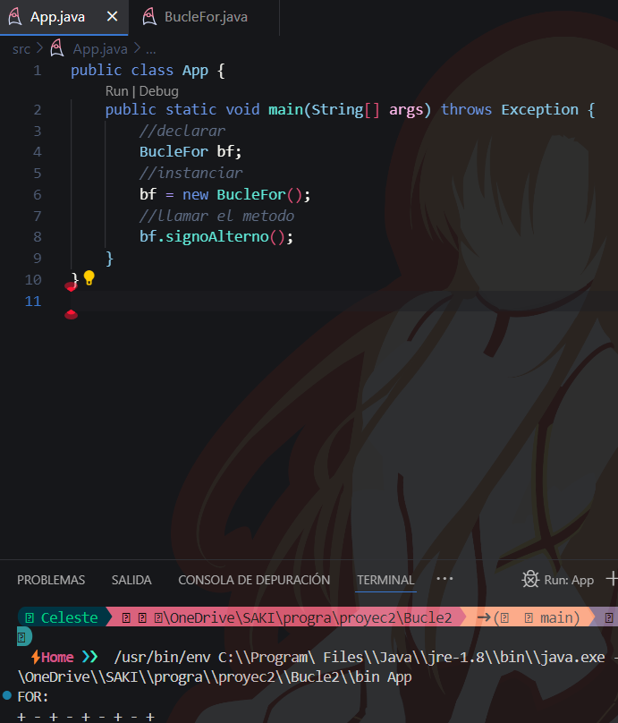

*Error (Depuracion)*


*Siguiente ejemplo*

entender matematicamente lo siguiente 
+-- +++ ----+++++....

Entender el patron del ejercicios:
* los impares son +
* los pares son -
* va aumentando conforme aumentan los numeros.
*se puede compactar el codigo.


*Ejercicio: La escalera*

* Niveles (variables): for (n)
	* un palito, se aumenta, cierra la escalera.

		* nivel 1: |_
		* nivel 2:   |_
		* nivel 3:     |_

	* se aumentan n niveles.

* aumentar la escalera a lo ancho (otra variable): for (h)
	* aumentar un espacio entre cada uno.

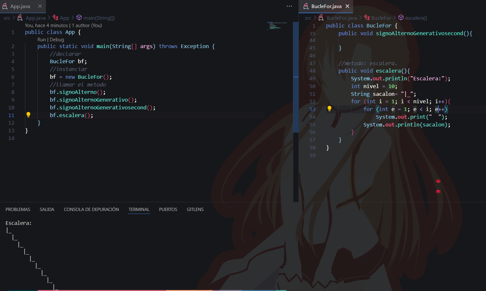

*While*

pasar de un for a while.

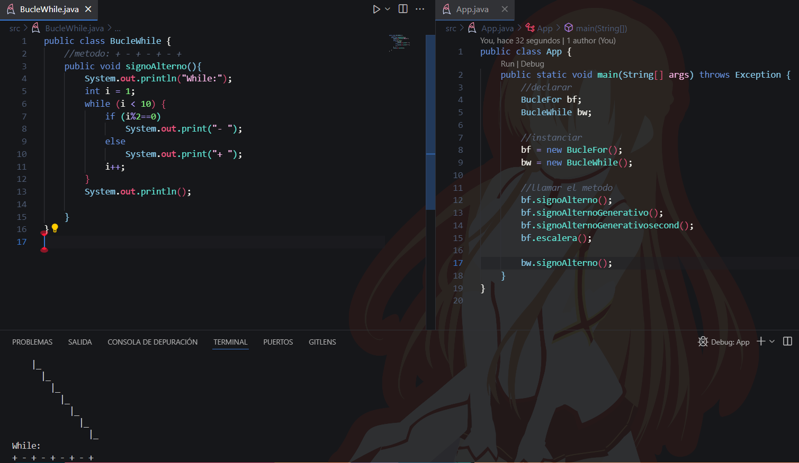


*Do While*

(xd)

# **Apuntes semana 3**

## **Clase 7**

*Paradigma*

* Solventar problemas.

1. ***Conceptualizacion:***

	* Idea de lo que se quiere realizar, se puede dibujar, diseñar, etc. Tener un aidea del resultado.
	* Como realizarlo.
	* ¿Que tengo? Ponerle nombre, concretar un significado.
	* Solo los objetos se pueden hacer dos cosas: Caracteristicas, acciones.

		* *Caracterisiticas:* propiedades. Almacenamiento de la informacion, cantidad, medir. (descripcion clara del objeto). Recomendacion: dibujarlo.
		* *Acciones:* metodos. Una accion es un verbo (jugar, correr, caminar...), que tenga sentido y vaya de acorde con las caracteristicas mencionadas y con la conceptualizacion que se quiere, debe tener parametros.
	
	* No salir del tema, definir un limite, una parte de la informacion.
	* No se invente.
	* Solo lo necesario al momento de describir.
	* Los parametros podria interpretarse como un limite.

		* *Parametros:* dentro de las acciones Ej: Caminar(tiempo, lugar...) informacion extra que da las instrucciones, para que el programa haga lo que tu quieres. Se parece a las propiedades. Pero cambian.

	* Definir si es publico o privado/protegido del objeto.

		* PUBLIC (+)
		* PRIVADE (-)
		* PROTEC ()
		* FRENDLY (#)
	
	* Definir si las caracteristicas y los metodos es alguna de esas, eso depende del programador, tiene uqe tener una razon para saber como se va a comportar eso. 

2. ***UML:***
	* *Significado:* Lenguaje de modelaje unificado.
	* Es el ¿Que?
	* Colocar en una clase. (Diagrama de clase)
	 
	* Ejemplo:

	|     + CLASE          |
	|----------------------|
	|- Edad: float         |
	|+ tieneOjos: bool     |
	|+ tipoCabello: String |
	|...                   |

	* Colocar las ideas, para que se identifiquen, para que estas empiezan a tener una forma mas solida, despues de colocar las caracteristicas se escriben los metodos.

	* Ejemplo N.-2:

	|     + CLASE                                                                 |
	|-----------------------------------------------------------------------------|
	|- Edad: float                                                                |
	|+ tieneOjos: bool                                                            |
	|+ tipoCabello: String                                                        |
	|...                                                                          |
	|- bailar(cancion: String; tiempoMin: int; ritmo: String): void/String/boolean|
	|+ tocar(cosaobjeto: String; tiempoMin: int): boolena                         |
	|- saltar(altura: int; cantidad: int): void                                   |
	|...                                                                          |

	* Void: no interesa
	* String: que de un resultado
	* Boolean: saber solo si cumplio o no cumplio.

	* *Interaccion con otros objetos:* se necesita un evento (algo que pasa por algo externo, interaccion/comunicacion entre dos objetos) esto se puede añadir como un cuerpo u objeto mas, esos son los eventos.

	|     + CLASE                                                                 |
	|-----------------------------------------------------------------------------|
	|- Edad: float                                                                |
	|+ tieneOjos: bool                                                            |
	|+ tipoCabello: String                                                        |
	|...                                                                          |
	|- bailar(cancion: String; tiempoMin: int; ritmo: String): void/String/boolean|
	|+ tocar(cosaobjeto: String; tiempoMin: int): boolena                         |
	|- saltar(altura: int; cantidad: int): void                                   |
	|...                                                                          |
	|- sentir (nombre: Hombre)                                                    |

	* Se pueden poner en lineas extra o alli mismo, depende del diseñador.
	* se debe utlizar un herramienta para Diagrama de clases.

3. ***Codigo (Java)***
	* Diagrama y codigo deben estar iguales.

* *Ejemplo:* Propiedades.

```java
public class Mujer {
	private float edad;
	public boolean tieneOjos;
	private String tipoCabello;
	...
}
```

* *Ejemplo N.- 2:* metodos.

```java
protected String bailar (String cancion; int tiempoMin; String ritmo) {
	...
	return "sjsjsmskdk..."
}	
```

* ***Deber***

	* Concetualizar un animal salvaje, a mano en una hoja.
	* Debe tener 3 propiedades y 3 metodos.

## **Clase 8**

// despues xd

## **Clase 9**

Comprobar que se tienen las siguientes extensiones:

* Herramientas:
	* drawn.io
	* excalidrawn
	* etc.

Abrir un nuevo proyecto, abrir solo la carpeta DEL PROYECTO, no mas solo la carpeta, se tiene que ver asi:

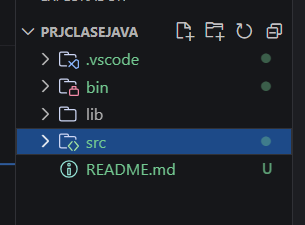

abri una pestaña de drawn.io

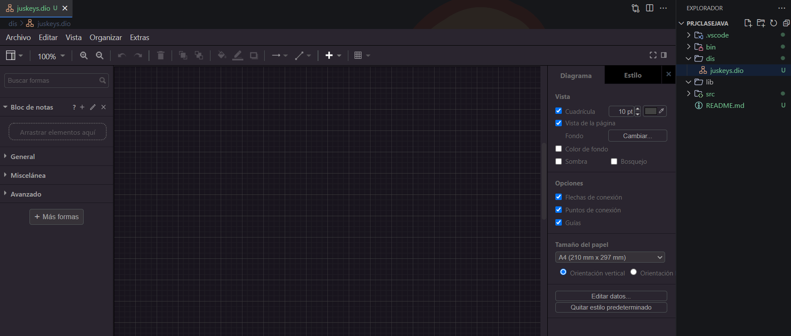

para los diseños abrir, en una nueva carpeta, nombre.dio (el "dio" es lo que hace que se transforme en ese formato)

diagramas **Caso de Uso**

Es para definir lo que se quiere relizar, tener una imagen concreta

En este ejemplo se usaron dos imagenes:


Se tiene la imagen, (use)
Donde se tienen varias ramas.

* relacion
* include
* externo

Pasa del diagrama de uso, interprentandolo, y pasandole a:

Diagramas de **Clase**

* relacion
* asociacion
* herencia

*(PARA EL PROYECTO SE DEBE TENER DIAGRAMA DE USO Y DIGRAMA DE CLASE)*

Comprobar que Java compile que la todo funcione

crear la imagen y pasar al UML

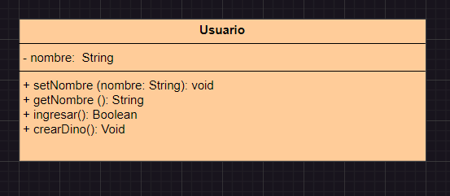

Tras eso pasarlo al codigo 

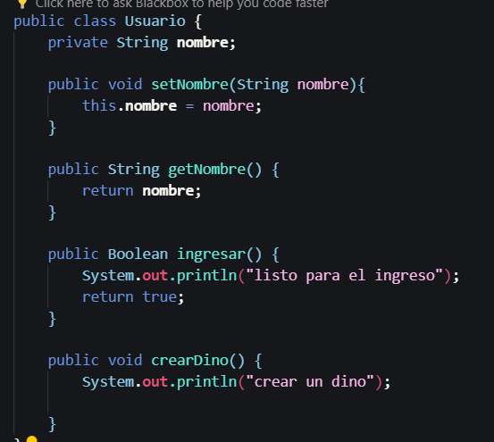

y ver que eso compile 

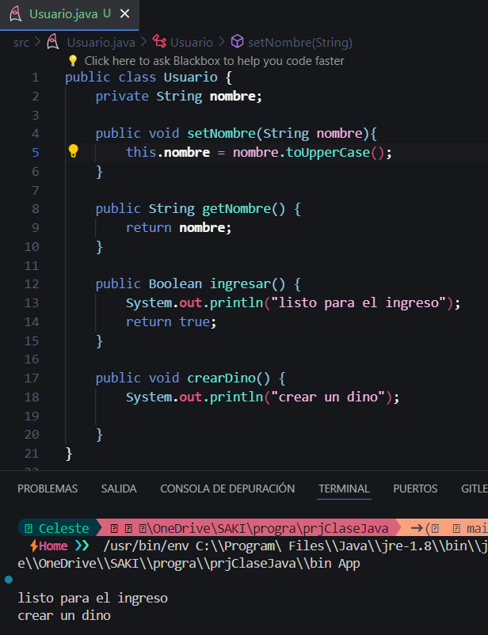

