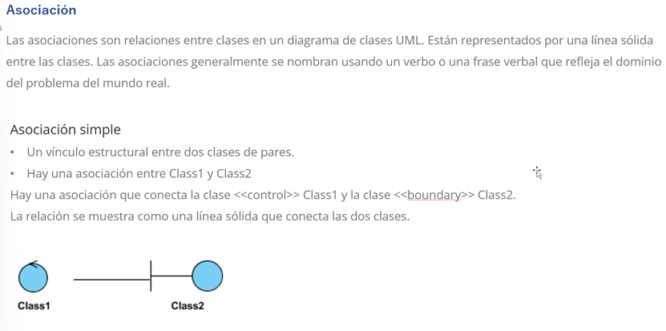
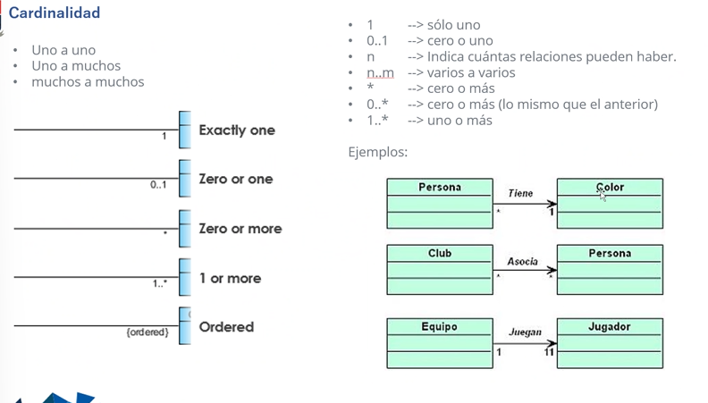
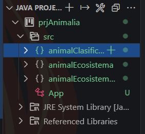
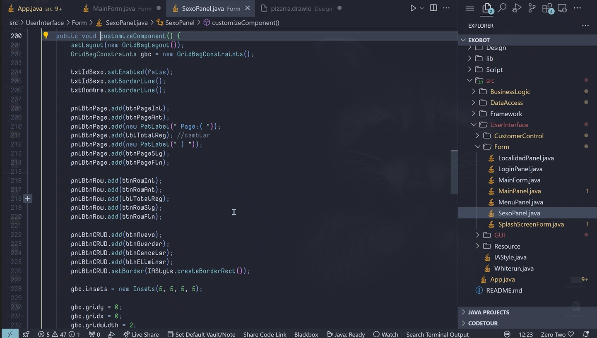
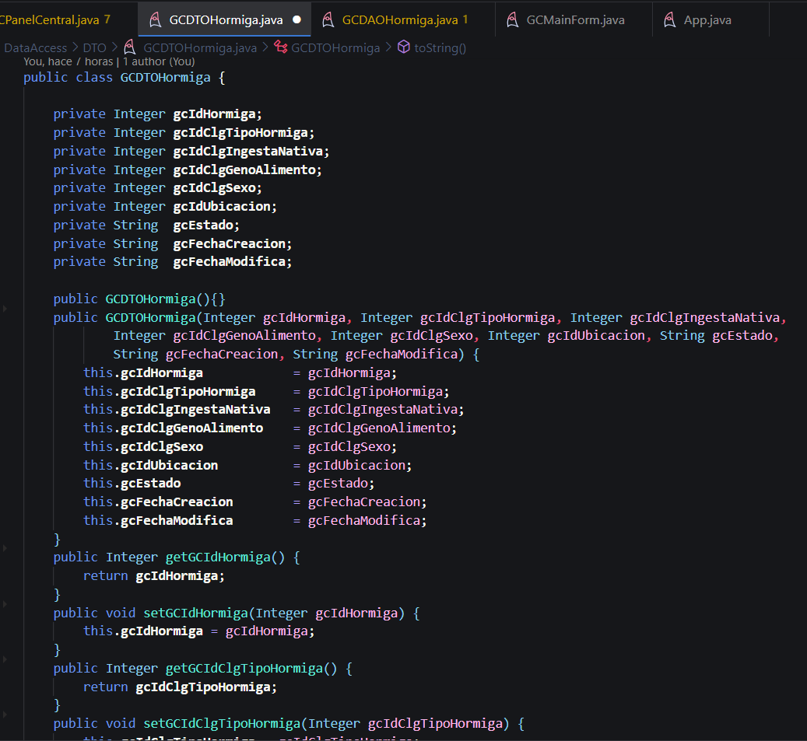
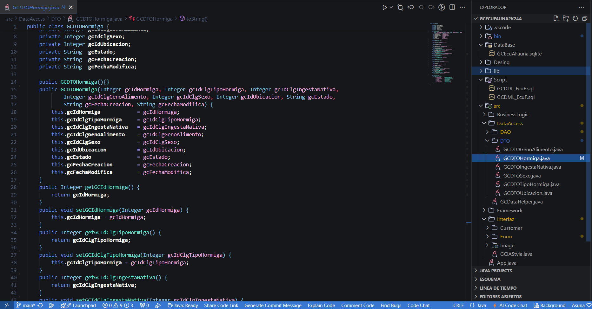
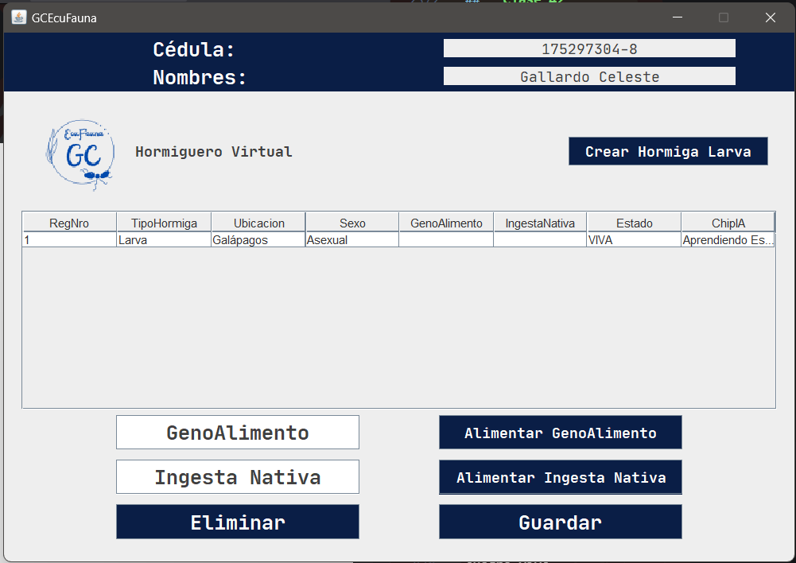

# **Apuntes Semana 2**

## **Clase 1**

***Presentación de la Materia: Programación II**

1. **Presentación del Profesor**

   - El curso comenzó con la introducción del profesor, quien detalló su experiencia, expectativas para la clase, y cómo se desarrollaría el contenido a lo largo del semestre.

2. **Presentación de los Estudiantes**

   - Los estudiantes tuvieron la oportunidad de presentarse, compartir sus antecedentes, intereses en la programación, y expectativas para el curso. Esto ayudó a establecer un ambiente colaborativo y conocer a los compañeros.

3. **Recursos Necesarios**

   - Se proporcionó información sobre los recursos que serán necesarios para los talleres, incluyendo software, documentación, y otras herramientas relevantes para el curso. Estos recursos serán fundamentales para completar las tareas y proyectos asignados.

4. **Primer Taller en Grupo**

   - El primer ejercicio práctico consistió en un taller grupal donde los estudiantes intentaron construir una torre lo más alta posible utilizando la menor cantidad de material. Este ejercicio, aunque no tuvo los mejores resultados, sirvió como una actividad de integración y como una introducción a la resolución de problemas en equipo.

5. **Evaluaciones**

   - Se explicó cómo se realizarían las evaluaciones del curso. Las pruebas estarán diseñadas para durar dos horas, evaluando conceptos clave vistos en clase. En contraste, los exámenes serán más extensos, con una duración de ocho horas, y abarcarán aplicaciones prácticas más complejas y desafíos de programación.

6. **Proyecto**

   - El proyecto final se entregará en dos partes: la primera parte se debe completar y entregar al final del primer bimestre, mientras que la segunda parte se entregará al final del segundo bimestre. Este proyecto servirá como una aplicación práctica y comprensiva de los conocimientos adquiridos durante el curso.

* Cuadro de evaluaciones y sus porcentajes:

|  Evaluación |   Puntaje |          |   |  Bonos Extras |  Puntaje    |
|-------------|-----------|----------|---|---------------|-------------|
| -Prueba     |   25%     |          |   |-Actuación     |  +0.1 punto |
| -Examen     |   25%     |          |   |-Retos         |  +1.0 punto |
| -Workshop   |   10%     |          |   |               |             |
| -Homework   |   10%     |          |   |               |             |
| -Proyecto   |   30%     |          |   |               |             |

**Explicación Detallada del Curso: Programación II**

1. **Explicación General del Curso**

   - Se dio una visión general de cómo se estructurará el curso, destacando la importancia de la práctica constante y el uso de herramientas específicas que los estudiantes deberán instalar y utilizar a lo largo del semestre.

2. **Aplicaciones Requeridas y Optimización**

   - Se enumeraron las aplicaciones que deben instalarse para realizar los trabajos prácticos. Se ofrecieron consejos sobre cómo optimizarlas para mejorar el rendimiento, así como opciones de personalización para hacerlas más cómodas y eficientes, lo que permitirá a los estudiantes maximizar su productividad y obtener mejores resultados en sus proyectos.

3. **Presentación de Apuntes en Markdown**

   - Al final de cada bimestre, los estudiantes deberán presentar sus apuntes utilizando el formato Markdown. Esto no solo fomenta una organización clara y profesional de las notas, sino que también ayuda a desarrollar habilidades en el uso de este formato ampliamente utilizado en la documentación técnica.

4. **Talleres en Grupo**

   - Durante el curso, se realizarán varios talleres en grupo que permitirán a los estudiantes aplicar lo aprendido de manera colaborativa. Estos talleres estarán diseñados para fomentar el trabajo en equipo y la resolución conjunta de problemas de programación.

5. **Proyecto en Grupo**

   - El proyecto final del curso se desarrollará en grupo y deberá incluir un aparato externo como parte de su implementación. Esto podría involucrar la integración de hardware con software, lo que representa un desafío adicional y una oportunidad para explorar áreas como el desarrollo de sistemas embebidos o la automatización.

6. **Presentación de la Normativa**

   - Se presentó la normativa del curso, que incluye reglas sobre la asistencia, la entrega de trabajos, y el comportamiento esperado en clase y durante las actividades grupales. Cumplir con estas normativas es esencial para mantener un ambiente de aprendizaje efectivo y respetuoso.

7. **Personalización de Aplicaciones de Trabajo**

   - Se proporcionaron instrucciones sobre cómo personalizar las aplicaciones de trabajo, como editores de código y entornos de desarrollo, para adaptarlas a las necesidades individuales de cada estudiante. La personalización puede incluir la configuración de temas, atajos de teclado, y extensiones que mejoren la eficiencia durante las sesiones de codificación.

8. **Aprendizaje de Comandos**

   - Se destacó la importancia de aprender y dominar los comandos necesarios para trabajar eficientemente con las aplicaciones y herramientas mencionadas. Esto incluye comandos para la línea de comandos, así como comandos específicos dentro de los entornos de desarrollo, que son fundamentales para acelerar el flujo de trabajo y evitar errores comunes.
## **Clase 2**

*Personalización* *del* *Visual* *Code* *y* *de* *Git* *bash*

* Para la personalización del Git Bash y del visual code, se puede personalizar su terminal para que esta sea la determinada en Visual Code y salga por defecto automaticamente, cada vez que se le llame con el comando CTRL + Ñ o manualmente.


Ademas se puede personalizar el git bash en si con la ayuda de otras aplicaciones externas, como por ejemplo: *Oh my posh* que es una de varias que pueden ayudar a darle un toque mas personal a la terminal y la consola de Git bash, con varios diseños y fuentes de se pueden instalar facilmente.


Esos son algunos de los diseños que se pueden conseguir en Oh my posh, de la misma forma la aplicacion permite crear un diseño nuevo, al final de la personalizacion se puede obtener un resultado asi en la terminal.


* De la misma forma se puede personalizar, el color de visual estudio con ayuda de los temas que vienen en la aplicación, pero tambien se pueden instalar otros, así mismo con los iconos de las aplicaciones o archivos que se abran dentro del visual.

* Tambien es recomendable cambiar la letra del visual code y de git bash para que sea mas comoda al momento de trabajar, pero eligiendo una que sea entendible y que facilite el trabajo.

Con todo eso listo, se puede tener una buena herramienta, que sea comoda y al gusto del usuario para trabajar adecuadamente.

*Comandos* :)

* **Windows**
    * CTRL + SHIFT + P: para abrir la barra de comandos donde estan las aplicaciones y funciones.

    * CTRL + P: para ver los documentos que se han abierto recientemente o buscar algun archivo para abrirlo.

    * CTRL + B: para aparecer y desaparecer la barra donde se observan las carpetas y documentos que estabn abiertos o almacenados.

    * CTRL + D: para selecionar varias lineas.

    * CTRL + S: para guardar.

    * CTRL + Ñ: para aparecer y desaparecer la terminal.

    * SHIFT + ALT + UP/DOWN: para copiar y pegar una linea del codigo.

    * ALT + ->: Para moverse entre los archivos que se encuentran abiertos en la barra de arriba.

    * ALT + ->(arriba): Para mover una linea del codigo ya sea arriba o abajo.

    * SHIFT + ALT + A: para poner una linea de comentario.

    * SHIFT + ALT: para selencionar la linea o palabra.

* **Linux**

    * pwd: para sar en que carpeta actual te encuentras.

	* cd: para cambiar de carpeta.

	* ls: para ver los archivos y carpetas que se encuentran en la carpeta actual.

	* mkdir: para crear una nueva carpeta.

	* rmdir: para eliminar una carpeta.

	* rm: para eliminar un archivo.

	* cp: para copiar un archivo.

	* mv: para mover un archivo.

	* cat: para ver el contenido de un archivo.

	* nano: para editar un archivo.

	* clear: para limpiar la terminal.

	* history: para ver los comandos que se han ejecutado recientemente.

	* :wq: para guardar y salir de un archivo.

	* :q: para salir de un archivo sin guardar.

	* :q!: para salir de un archivo sin guardar y sin confirmar.

	* :set nu: para mostrar los numeros de las lineas.

	* :set nonu: para ocultar los numeros de las lineas.

	* :set list: para mostrar los caracteres no impresos.

	* :set nolist: para ocultar los caracteres no impresos.

	* :set ic: para hacer la busqueda insensible a mayusculas y minusculas.

	* :set noic: para hacer la busqueda sensible a mayusculas y minusculas.

	* :set hlsearch: para mostrar los resultados de la busqueda.

	* :set nohlsearch: para ocultar los resultados de la busqueda.

    * touch: para crear un nuevo archivo de cualquier tipo.

    * code: para abrir el documento creado.
## **Clase 3**

**Uso de Markdown y Manejo de Git/GitHub**

**Uso de Markdown**

Markdown es una herramienta poderosa para tomar apuntes y crear documentos sin salir del entorno de desarrollo, como Visual Studio Code. Una de las ventajas de Markdown es que permite generar archivos en formato PDF para su distribución y lectura, lo que lo hace ideal para documentar código y elaborar informes.

**Elementos Básicos de Markdown**

- **Títulos**:

  - Se crean utilizando el símbolo `#`. Cuantos más `#` se utilicen, más bajo será el nivel del título.

  - Ejemplo:

    ```markdown
    # Título Principal
    ## Subtítulo
    ### Subtítulo Nivel 3
    ```

- **Cursiva**:

  - Se aplica rodeando la palabra o frase con un asterisco `*` a cada lado.

  - Ejemplo: `*Cursiva*` se ve como *Cursiva*.

- **Negrillas**:

  - Se aplica rodeando la palabra o frase con dos asteriscos `**` a cada lado.

  - Ejemplo: `**Negrilla**` se ve como **Negrilla**.

- **Negrilla y Cursiva**:

  - Se aplican simultáneamente rodeando el texto con tres asteriscos `***` a cada lado.

  - Ejemplo: `***Negrilla y Cursiva***` se ve como ***Negrilla y Cursiva***.

- **Enlaces**:

  - Se crean usando el formato `[Texto del enlace](URL)`.

  - Ejemplo: `[YouTube](https://www.youtube.com/)` enlaza a [YouTube](https://www.youtube.com/).

- **Imágenes**:

  - Se insertan con el formato ``.

  - Ejemplo: `` inserta una imagen.

- **Bloques de Código**:

  - Se rodea el código con tres acentos graves `` ``` `` y se indica el lenguaje de programación para resaltar la sintaxis.

  - Ejemplo:

    ```markdown
    ```c++
    #include <iostream>
    using namespace std;
    int main() {
        cout << "Hola, Mundo!";
        return 0;
    }
    ```
    ```

- **Tablas**:

  - Se crean utilizando `|` para separar columnas y `---` para definir los encabezados.

  - Ejemplo:

    ```markdown
    | Columna 1  | Columna 2  |
    |------------|------------|
    | Dato 1     | Dato 2     |
    | Dato 3     | Dato 4     |
    ```

- **Comandos Útiles**:

  - `CTRL + SHIFT + V`: Permite ver la vista previa del documento Markdown en Visual Studio Code.

**Manejo de Git/GitHub**

Git y GitHub son esenciales para el control de versiones y la colaboración en proyectos de programación. Aquí se resumen los comandos básicos y su aplicación.

**Comandos de Git**

- **Inicialización del Repositorio**:

  - `git init`: Crea un nuevo repositorio de Git en el directorio actual.

- **Estado del Repositorio**:

  - `git status`: Muestra el estado de los archivos, indicando cuáles han sido modificados o agregados.

- **Añadir Archivos**:

  - `git add .`: Añade todos los archivos y cambios al área de preparación.

- **Guardar Cambios (Commit)**:

  - `git commit -m "Mensaje"`: Guarda los cambios realizados en el repositorio con un mensaje descriptivo.

- **Subir Cambios**:

  - `git push origin main`: Envía los cambios locales al repositorio remoto en la rama principal.

- **Actualizar Cambios Locales**:

  - `git pull`: Descarga los cambios más recientes del repositorio remoto y los integra en la rama local.

- **Clonar Repositorios**:

  - `git clone [URL del repositorio]`: Crea una copia local de un repositorio remoto.

- **Comprobar Repositorio Remoto**:

  - `git remote -v`: Verifica la URL del repositorio remoto con el que está sincronizado el repositorio local.

- **Ver Log de Cambios**:

  - `git log`: Muestra el historial de commits del repositorio.

**Subida de Archivos a GitHub**

1. **Clonar un Repositorio**:

   - Crear una carpeta en la que se clonará el repositorio de GitHub.

   - Utilizar Git Bash y ejecutar `git clone [URL del repositorio]` en la terminal dentro de la carpeta creada.

2. **Realizar Cambios y Subir a GitHub**:

   - Abrir Visual Studio Code y utilizar los siguientes comandos:

     - `git status`: Verifica los cambios realizados.

     - `git add .`: Agrega todos los archivos al área de preparación.

     - `git commit -m "Mensaje descriptivo"`: Realiza un commit con los cambios.

     - `git push origin main`: Sube los cambios al repositorio en GitHub.

     - `git log`: Comprueba el historial de commits para asegurarse de que los cambios se han subido correctamente.

3. **Resumen del Proceso de Trabajo**:

   - Clonar el repositorio, realizar los cambios necesarios en la carpeta clonada, y luego utilizar los comandos de Git para gestionar y subir esos cambios al repositorio en GitHub.

Con esta combinación de Markdown para la documentación y Git/GitHub para la gestión de código, se puede mantener un flujo de trabajo organizado y eficiente, permitiendo a los desarrolladores colaborar y compartir su progreso de manera efectiva.

# **Apuntes Semana 3**

## **Clase 4**
*Programacion orientada a objetos*

* Java
	* Nace por problemas con el compilador, por las diferencias entre un sisitema y otro.
	* Ayuda a la distribucion del los codigos complentando los codigos del compilador.

* Funcionamiento:
	* codigo
	* compilacion
	* bytecode
	* JVM
	* Multiplataforma

*Tipos de lenguaje*

* Compilador:

	No ejecuta el programa si tiene el minimo error, proceso de compilacion que se presenta en el "trabajo" solo se tiene consola no el *F5*.

* Interprete:
 
	Es mas permisivo y lee el codigo, se detiene al encontrar un error.


*Tipos de Java*

Se tienen varios.


*Estructura del lenguaje*

* *package*: conjunto de librerias.

* *import*: escoger una libreria.

* ***: para traer, pero es mejor traer de forma mas especifica para no cargar demaciado el sistema.

* *class*: usa clases para ejecutar el codigo,debe estar en minusculas.

* *string*: tipos 

* *public static void main*: aprender debe estar alli.

*Ejemplo*


*Diferencias*

Existen varias diferencias entre las estrucutras y Progamacion orientada a objetos (O.O) de como funcionaba en C++ y como funciona ahora en Java.

|Estrucutra        |O.O              |
|------------------|-----------------|
|include (libreria)|import (paquetes)|
|funciones         |metodos          |
|struct            |clases           |
|variables         |propiedades      |

* Propiedades:
	* Ambito: public(+), private(-), protec, friendly. (si se olvida de colocar esto el programa solo se pone en privado, en pocos casos en publico)  
		
		en URL tienen simbolos.

	* Tipo de dato: 	int, char.
	* Nombre

* Metodos:
Las variables si existen solo que se ecuentran dentro de los metodos, no se puede tener fuera de estos *si se tiene fuera se convierten en propiedad*.
	* Metodo que retorne valor.
	* Metodo sin retorno (void).

*Diferencia entre punteros*
*En almacenamiento es lo mismo, pero al referirse en C es mas complicado que en Java, en c se puede darña facilmente y se debe gestionar "manualmente" los punteros, mientras que en Java esto se realiza de forma automatica, ya no es necesario todo el procedimiento que se da en C, basicamente Java facilita el proceso.*

Se pueden utlizar diagramas de flujo y el URL.

NO OLVIDAR EL PUNTO Y COMA (;) :v

*Aplicaciones*

Java gana en aplicaciones industriales.

*Diagrama de flujo*

Es importante la ilustracion de digramas de flujo para ver de forma grafica el codigo.


*TRACE*

Pseudocodigo.
Pruebas de escritorio, seguimiento a la corrida de un programa.
Automatizar el TRACE.

* Errores: el como esta escrito, mayusculas, minusculas, etc. Todo eso afecta.

* Forma correcta:


* For incorrecta:


*Primer Codigo*

SHIFT + CNTRL + P

Poner un entorno base, en blanco, nuevo.

* pide que guardes en una carpeta.

Nombre: Proyecto 1.

* src: codigo fuente.

```java
public class Hi {
	//propiedades aqui afuera.
	public static void main(String[] args){
		//metodos, funciones.
		int n = 10;
		for( int i = 0; i < n; i++){
			System.out.println(i);
		}
	}
	}
```
* Compilar y Ejecutar desde consola:
pwd: donde se encuentra.
compilar: javac *Nombre del archivo*
Ejecutar: *Nombre del archivo*

*COMO FUNCIONA UN for*

```java
int n = 1O;
for( int i = 0; i < n; i++)
	System.out.println(i);
```

(int i = 0): se puede poner fuera, se pone dentro para ahorrar una linea.
(i < n): se puede cambiar a true or false 
TRUE: acepta el codigo, condicion.
FALSE: NO FUNCIONA, es como decir que no es real o falso lo que dice, entonces el codigo dice: "para que pones si es falso? :v".
(i++/i--): para que sume o reste.

*for para que comience en 2 y se aumente de 2 en 2*

```java
int n = 1O;
for( int i = 2; i < n; i+=2)
	System.out.println(i);
```

(i+=2): forma abreviada para aumentar ya no solo de 1 en 1, sino mas.
(i=i+2): forma no abreviada.

*CONDICIONAL (if)*

```java
int n = 1O;
for( int i = 0; i < n; i++)
	if (i = 6)
		System.out.println("hay un sesis");
	else 
		System.out.println(i);
```

cuando toque en el numero 6 en la ejecución, en lugar de salir "6" saldra "hay un seis".

(else): es parte de la misma instrucción del if.

```java
public class Hi {
	//propiedades aqui afuera.
	public static void main(String[] args){
		//metodos, funciones.
		int n = 10;
		for( int i = 2; i < n; i+=2){
			if (i = 6)
				System.out.println("hay un seis");
			else 
				System.out.println(i);
		}
	}
	}
```

codigo mas compacto con **OPERADOR TERNARIO**

```java
public class Hi {
	//propiedades aqui afuera.
	public static void main(String[] args){
		//metodos, funciones.
		int n = 10;
		for( int i = 2; i < n; i+=2){
			System.out.println("hay un seis");
		}
	}
	}
```
(terminar de poner el codigo compacto xd)
## **Clase 5**

### **Bucles**

Los bucles son estructuras de control fundamentales en programación, que permiten ejecutar repetidamente un bloque de código hasta que se cumpla una condición específica. Uno de los bucles más utilizados es el `for`, el cual es particularmente útil cuando se conoce de antemano cuántas veces se debe repetir el ciclo.

**Bucle `for`**

- **Función Principal**:

  - El bucle `for` permite definir un punto de inicio, una condición para continuar iterando, y una actualización de la variable de control después de cada iteración.

  - Es ideal para recorrer rangos de números, iterar sobre elementos en una colección, o repetir una tarea un número específico de veces.

- **Sintaxis Básica**:

  - En la mayoría de los lenguajes de programación, la estructura básica de un `for` se ve así:

    ```java
    for (int i = 0; i < 10; i++) {
        // Código a ejecutar en cada iteración
        System.out.println("Iteración: " + i);
    }
    ```
  - Aquí, `i` se inicializa en 0, el bucle continúa mientras `i` sea menor que 10, y `i` se incrementa en 1 después de cada iteración.

**Creación de Documentos**

- Al trabajar con bucles, especialmente cuando se generan documentos o archivos en cada iteración, es crucial estructurar correctamente el código para asegurar que cada documento se cree y guarde sin errores.

- **Ejemplo de Creación de Documentos**:

  - Al generar múltiples informes o archivos en un bucle, se debe asegurar que cada archivo tenga un nombre único y que los recursos (como flujos de archivo) se cierren correctamente al final de cada iteración.

    ```java
    for (int i = 0; i < 5; i++) {
        FileWriter fileWriter = new FileWriter("documento_" + i + ".txt");
        fileWriter.write("Este es el documento número " + i);
        fileWriter.close(); // Cierre del archivo
    }
    ```

**Pretty Format**

- **Descripción**:

  - La extensión "Pretty Format" es una herramienta de formateo de código que asegura que el código fuente esté bien estructurado y sea legible. Es especialmente útil para mantener la consistencia en la indentación y el cierre correcto de bloques de código, como corchetes `{}` en bucles.

- **Instalación**:

  - Para instalar "Pretty Format", se puede buscar en el marketplace de extensiones del editor de código (como Visual Studio Code). Una vez instalada, puede configurarse para formatear automáticamente el código al guardar.

- **Uso**:

  - Ayuda a evitar errores visuales y de sintaxis, asegurando que los corchetes y otros delimitadores estén correctamente alineados y cerrados.

**Instanciación de Clases**

- **Instanciación**:

  - La instanciación es el proceso de crear un objeto a partir de una clase. Esto se hace utilizando la palabra clave `new`, que asigna memoria y prepara el objeto para su uso.

  - Ejemplo:

    ```java
    BucleFor bf = new BucleFor();
    ```

  - En este ejemplo, `BucleFor` es la clase y `bf` es la instancia del objeto, lo que "da vida" al bucle o estructura definida en esa clase.

**Extensión Power Mode**

- **Descripción**:

  - Power Mode es una extensión visual que añade efectos dinámicos y llamativos al editor de código, como partículas y vibraciones de pantalla al escribir. Aunque principalmente estética, puede hacer que el trabajo en el código sea más entretenido y motivador.
  
- **Instalación**:

  - Similar a otras extensiones, se instala desde el marketplace del editor. Aunque su función es principalmente estética, es compatible con la mayoría de los entornos de desarrollo y no interfiere con la funcionalidad principal del código.

**Revisión de Errores**

- **Errores Comunes en Bucles**:

  - **Condiciones de Salida Incorrectas**: Asegurarse de que el bucle tiene una condición de salida válida, de lo contrario, puede causar bucles infinitos que congelan el programa.

  - **Errores de Sintaxis**: Falta de cierre de corchetes `{}`, paréntesis `()`, o puntos y comas `;` son errores comunes que pueden impedir que el código compile.

  - **Acceso Fuera de Rango**: Al iterar sobre arrays o listas, asegurarse de que no se intenta acceder a un índice fuera del rango, lo que puede causar excepciones.

- **Herramientas de Depuración**:

  - Utilizar las herramientas de depuración del IDE para revisar y solucionar errores antes de que se compile el código. Estas herramientas pueden detener la ejecución en puntos clave y permitir examinar el estado de las variables durante la iteración de un bucle.

- **Imagen Referencial**:

  - 
## **Clase 6**

**Bucles For - Parte 2**

**Orden del Directorio**

Cuando se trabaja en proyectos de programación, es fundamental mantener un orden adecuado en los directorios para facilitar la organización y el acceso a los archivos.

- **Proyectos en Distintas Carpetas**:

  - Es recomendable organizar cada proyecto en su propia carpeta. Esto no solo mantiene el trabajo ordenado, sino que también ayuda a evitar confusiones entre archivos y configuraciones.

- **Crear un Nuevo Proyecto**:

  - Al iniciar un nuevo proyecto en Java, se crea un directorio con una estructura predefinida que incluye un directorio `src` (source) y un archivo `App.java`.

  - El archivo `App.java` actúa como el punto de entrada del proyecto, desde donde se puede compilar y ejecutar el programa.

- **Estructura del Proyecto**:

  - **`src`**: Contiene el código fuente del proyecto.

  - **`App.java`**: Archivo principal que puede contener el método `main`, que es el punto de inicio del programa.

  

- **Creación de Archivos Dentro del Proyecto**:

  - Se puede crear un nuevo archivo en la carpeta `src`, que puede ser de diferentes tipos, como `Class`, `Interface`, o `Enum`.

  - Para este ejemplo, se seleccionó **Class** y se nombró **BucleFor**.

 Es importante recordar que en Java, las clases deben comenzar con una letra mayúscula, lo cual es una convención estándar en la programación orientada a objetos.

  

**Compilación del Código For**

- **Trabajo con la Clase `BucleFor`**:

  - Después de crear la clase `BucleFor`, se comenzó a trabajar en el código dentro de ella, implementando un bucle `for` básico para ilustrar su funcionamiento.

  

- **Ejemplo de Código Compilado**:

  - Una vez implementado el código, se compila para verificar que no haya errores de sintaxis y que el bucle funcione como se espera.

  

**Errores y Depuración**

- **Identificación de Errores**:

  - Durante la compilación, es posible que se encuentren errores. Es esencial aprender a leer y entender los mensajes de error que proporciona el compilador para corregirlos rápidamente.
  
  

**Siguiente Ejemplo - Secuencia Matemática**

- **Entendiendo el Patrón**:

  - En algunos ejercicios, es necesario identificar patrones matemáticos para escribir un bucle eficiente.

  - Ejemplo: En una secuencia de símbolos como `+--+++----+++++...`, es importante notar que:

    - Los números impares están representados por `+`.

    - Los números pares están representados por `-`.

    - La cantidad de símbolos aumenta con cada iteración.

- **Compactación del Código**:

  - Una vez entendido el patrón, se puede simplificar y compactar el código para que sea más eficiente y legible.

  

**Ejercicio: La Escalera**

- **Construyendo una Escalera con Bucles**:

  - Este ejercicio consiste en usar bucles anidados para construir una escalera en la consola, donde cada nivel de la escalera es representado por líneas horizontales y verticales.

- **Niveles (Variable `n`)**:

  - **`for (n)`**: Controla cuántos niveles tendrá la escalera. A medida que aumenta `n`, se agrega un nuevo nivel a la escalera.

  - Ejemplo:
    - Nivel 1: `|_`
    - Nivel 2: `  |_`
    - Nivel 3: `    |_`
  
- **Ancho de la Escalera (Variable `h`)**:

  - **`for (h)`**: Controla el espacio entre los niveles de la escalera, aumentando la distancia a medida que se sube de nivel.

  

**Bucle While**

- **Conversión de `for` a `while`**:

  - El bucle `while` se utiliza cuando no se sabe de antemano cuántas veces se debe repetir un bloque de código. A diferencia del `for`, en `while` la condición se evalúa antes de ejecutar el bloque de código.

  - Ejemplo de conversión:
    ```java
    int i = 0;
    while (i < 10) {
        System.out.println("Iteración: " + i);
        i++;
    }
    ```

  

  

**Bucle Do-While**

- **Características**:

  - El bucle `do-while` es similar al `while`, pero la principal diferencia es que el bloque de código se ejecuta al menos una vez antes de evaluar la condición.

  - Esto es útil cuando se necesita ejecutar el código y luego decidir si se debe repetir.

- **Sintaxis**:
  ```java
  int i = 0;
  do {
      System.out.println("Iteración: " + i);
      i++;
  } while (i < 10);
  ```

En resumen, dominar los bucles y sus variaciones (`for`, `while`, `do-while`) es esencial para escribir código eficiente y flexible. Además, la correcta organización del directorio del proyecto y la capacidad de depurar errores contribuyen a un flujo de trabajo más productivo y menos propenso a errores.

# **Apuntes semana 4**

## **Clase 7**

*Paradigma*

* Solventar problemas.

1. ***Conceptualizacion:***

	* Idea de lo que se quiere realizar, se puede dibujar, diseñar, etc. Tener un aidea del resultado.
	* Como realizarlo.
	* ¿Que tengo? Ponerle nombre, concretar un significado.
	* Solo los objetos se pueden hacer dos cosas: Caracteristicas, acciones.

		* *Caracterisiticas:* propiedades. Almacenamiento de la informacion, cantidad, medir. (descripcion clara del objeto). Recomendacion: dibujarlo.
		* *Acciones:* metodos. Una accion es un verbo (jugar, correr, caminar...), que tenga sentido y vaya de acorde con las caracteristicas mencionadas y con la conceptualizacion que se quiere, debe tener parametros.
	
	* No salir del tema, definir un limite, una parte de la informacion.
	* No se invente.
	* Solo lo necesario al momento de describir.
	* Los parametros podria interpretarse como un limite.

		* *Parametros:* dentro de las acciones Ej: Caminar(tiempo, lugar...) informacion extra que da las instrucciones, para que el programa haga lo que tu quieres. Se parece a las propiedades. Pero cambian.

	* Definir si es publico o privado/protegido del objeto.

		* PUBLIC (+)
		* PRIVADE (-)
		* PROTEC ()
		* FRENDLY (#)
	
	* Definir si las caracteristicas y los metodos es alguna de esas, eso depende del programador, tiene uqe tener una razon para saber como se va a comportar eso. 

2. ***UML:***
	* *Significado:* Lenguaje de modelaje unificado.
	* Es el ¿Que?
	* Colocar en una clase. (Diagrama de clase)
	 
	* Ejemplo:

	|     + CLASE          |
	|----------------------|
	|- Edad: float         |
	|+ tieneOjos: bool     |
	|+ tipoCabello: String |
	|...                   |

	* Colocar las ideas, para que se identifiquen, para que estas empiezan a tener una forma mas solida, despues de colocar las caracteristicas se escriben los metodos.

	* Ejemplo N.-2:

	|     + CLASE                                                                 |
	|-----------------------------------------------------------------------------|
	|- Edad: float                                                                |
	|+ tieneOjos: bool                                                            |
	|+ tipoCabello: String                                                        |
	|...                                                                          |
	|- bailar(cancion: String; tiempoMin: int; ritmo: String): void/String/boolean|
	|+ tocar(cosaobjeto: String; tiempoMin: int): boolena                         |
	|- saltar(altura: int; cantidad: int): void                                   |
	|...                                                                          |

	* Void: no interesa
	* String: que de un resultado
	* Boolean: saber solo si cumplio o no cumplio.

	* *Interaccion con otros objetos:* se necesita un evento (algo que pasa por algo externo, interaccion/comunicacion entre dos objetos) esto se puede añadir como un cuerpo u objeto mas, esos son los eventos.

	|     + CLASE                                                                 |
	|-----------------------------------------------------------------------------|
	|- Edad: float                                                                |
	|+ tieneOjos: bool                                                            |
	|+ tipoCabello: String                                                        |
	|...                                                                          |
	|- bailar(cancion: String; tiempoMin: int; ritmo: String): void/String/boolean|
	|+ tocar(cosaobjeto: String; tiempoMin: int): boolena                         |
	|- saltar(altura: int; cantidad: int): void                                   |
	|...                                                                          |
	|- sentir (nombre: Hombre)                                                    |

	* Se pueden poner en lineas extra o alli mismo, depende del diseñador.
	* se debe utlizar un herramienta para Diagrama de clases.

3. ***Codigo (Java)***
	* Diagrama y codigo deben estar iguales.

* *Ejemplo:* Propiedades.

```java
public class Mujer {
	private float edad;
	public boolean tieneOjos;
	private String tipoCabello;
	...
}
```

* *Ejemplo N.- 2:* metodos.

```java
protected String bailar (String cancion; int tiempoMin; String ritmo) {
	...
	return "sjsjsmskdk..."
}	
```

* ***Deber***

	* Concetualizar un animal salvaje, a mano en una hoja.
	* Debe tener 3 propiedades y 3 metodos.
## **Clase 9**

Comprobar que se tienen las siguientes extensiones:

* Herramientas:
	* drawn.io
	* excalidrawn
	* etc.

Abrir un nuevo proyecto, abrir solo la carpeta DEL PROYECTO, no mas solo la carpeta, se tiene que ver asi:


abri una pestaña de drawn.io


para los diseños abrir, en una nueva carpeta, nombre.dio (el "dio" es lo que hace que se transforme en ese formato)

diagramas **Caso de Uso**

Es para definir lo que se quiere relizar, tener una imagen concreta

En este ejemplo se usaron dos imagenes:


Se tiene la imagen, (use)
Donde se tienen varias ramas.

* relacion
* include
* externo

Pasa del diagrama de uso, interprentandolo, y pasandole a:

Diagramas de **Clase**

* relacion
* asociacion
* herencia

*(PARA EL PROYECTO SE DEBE TENER DIAGRAMA DE USO Y DIGRAMA DE CLASE)*

Comprobar que Java compile que la todo funcione

crear la imagen y pasar al UML


Tras eso pasarlo al codigo 


y ver que eso compile 


# **Apuntes semana 5**

## **Clase10**

**Ejemplo de Cómo Trabaja TUTI**

**Actor**: En el contexto de TUTI, un "actor" es cualquier entidad que interactúa con el sistema. Esto puede incluir usuarios, clientes, o cualquier agente externo que realice una acción dentro del sistema.

- **Ejemplo**: En TUTI, un cliente (actor) puede **seleccionar un producto de los estantes**. Este es un ejemplo de cómo un actor utiliza el sistema para realizar una acción específica.

- **Ejemplo 2**: El cliente también puede **pagar los productos seleccionados**. En este caso, el **cajero** es quien recibe el pago. El sistema de caja asiste al cajero en el proceso de pago, pero su uso inadecuado puede causar dificultades.

**App**: Refleja el sistema en sí mismo, que en este caso es TUTI. 

**Identificación de Procesos y Situaciones**

1. **Procesos de Devoluciones**:

   - Permiten a los clientes devolver productos. Este proceso puede incluir la verificación de la razón de la devolución y el ajuste del inventario.

2. **Procesos de Cancelación**:

   - Requiere **autorización de un supervisor**. La cancelación puede involucrar la anulación de una transacción y la actualización de registros.

3. **Proceso de Enviar Comprobante Electrónico**:

   - Implica enviar un comprobante de compra al cliente de manera electrónica, a menudo por correo electrónico.

**Nuevas Funcionalidades**

1. **Productos en Línea para Envío a Casa**:

   - Los clientes pueden seleccionar productos para ser enviados a su hogar.

   - **Pago de Productos Seleccionados**: Obligatorio para completar la compra.

   - **Pagar con Tarjeta de Crédito/Débito**: Opcional, proporcionando flexibilidad en los métodos de pago.

**Herencia en Programación**

**Aspectos Comunes**:

- Permite la reutilización de código, optimiza la gestión y protege la información al encapsular datos y comportamientos comunes en una clase base.

1. **Conceptualización**:

   - Identificar y definir las características comunes entre diferentes clases que pueden ser agrupadas en una clase base.

2. **UML (Unified Modeling Language)**:

   - Usado para representar visualmente la estructura de clases y las relaciones entre ellas. Se emplean diagramas de clases para modelar la herencia y otros aspectos de la programación orientada a objetos.

- **Privacidad**:

  - Las propiedades y métodos en una clase base pueden ser definidos como `private`, `protected`, o `public`, controlando su accesibilidad desde otras clases.

- **Ejemplo**:

  - Una clase `Producto` puede ser una clase base para `ProductoElectrónico` y `ProductoAlimenticio`, cada una con atributos y comportamientos específicos.

**Generalización**

**Palabras Clave**:

- **ES UN**: Utilizada para describir la relación de herencia, donde una clase "es un" tipo específico de otra clase. Ejemplo: `Coche es un Vehículo`.

- **PUEDE SER**: Utilizada para describir la relación de generalización, donde una clase "puede ser" uno de varios tipos. Ejemplo: `Transacción puede ser Compra o Venta`.

**Aspectos a Considerar**

- **Valor Numérico**:

  - Cuando se trabaja con valores numéricos, es importante definir su tipo de dato (`int`, `float`, `double`, etc.) y considerar cómo se utilizarán (operaciones aritméticas, comparaciones).

- **Diseño**:

  - Crear un diseño conceptual antes de implementar el código. Esto puede incluir diagramas y descripciones detalladas del sistema y sus componentes.

En resumen, la programación en TUTI y otros sistemas involucra el uso de actores y procesos para gestionar la interacción del usuario con el sistema. La herencia y la generalización son conceptos clave en la programación orientada a objetos que permiten una estructura más organizada y eficiente del código.
## **Clase 11**

**Constructor y Sobrecarga en Programación**

**Constructor**

- **Definición**: Un constructor es un método especial en una clase que se utiliza para inicializar objetos de esa clase. Su nombre es el mismo que el de la clase y no tiene un tipo de retorno.

- **Visibilidad**:

  - **Público**: El constructor puede ser accedido desde cualquier otra clase.

  - **Protegido**: El constructor solo puede ser accedido dentro de la misma clase y por clases derivadas.

- **Características**:

  - **Por Defecto**: Si no se define un constructor en una clase, Java proporciona un constructor por defecto sin argumentos. Este constructor inicializa las variables de instancia a sus valores predeterminados.
  
  - **Inicialización**: Se utiliza para establecer valores iniciales para las variables de instancia del objeto.

  - **Ejecución Automática**: Se llama automáticamente cuando se crea un nuevo objeto de la clase. No es necesario invocar el constructor explícitamente.

- **Ejemplo**:

  ```java
  public class Coche {
      private String modelo;
      private int año;

      // Constructor
      public Coche(String modelo, int año) {
          this.modelo = modelo;
          this.año = año;
      }

      // Método para mostrar información del coche
      public void mostrarInfo() {
          System.out.println("Modelo: " + modelo + ", Año: " + año);
      }
  }

  public class Main {
      public static void main(String[] args) {
          // Creación de un objeto Coche, constructor se llama automáticamente
          Coche miCoche = new Coche("Toyota", 2020);
          miCoche.mostrarInfo();
      }
  }
  ```

**Sobrecarga de Constructores**

- **Definición**: La sobrecarga de constructores ocurre cuando una clase tiene más de un constructor con diferentes listas de parámetros. Esto permite crear objetos de una clase de diferentes maneras, dependiendo de los argumentos proporcionados.

- **Características**:

  - **Diferentes Parámetros**: Cada constructor sobrecargado debe tener una lista de parámetros diferente (número, tipo, o ambos).

  - **Flexibilidad**: Proporciona flexibilidad en la creación de objetos, permitiendo diferentes formas de inicialización.

- **Ejemplo**:

  ```java
  public class Coche {
      private String modelo;
      private int año;
      private String color;

      // Constructor con dos parámetros
      public Coche(String modelo, int año) {
          this.modelo = modelo;
          this.año = año;
          this.color = "No especificado"; // Valor por defecto
      }

      // Constructor con tres parámetros (sobrecargado)
      public Coche(String modelo, int año, String color) {
          this.modelo = modelo;
          this.año = año;
          this.color = color;
      }

      // Método para mostrar información del coche
      public void mostrarInfo() {
          System.out.println("Modelo: " + modelo + ", Año: " + año + ", Color: " + color);
      }
  }

  public class Main {
      public static void main(String[] args) {
          // Usando el primer constructor
          Coche miCoche1 = new Coche("Honda", 2019);
          miCoche1.mostrarInfo();

          // Usando el segundo constructor
          Coche miCoche2 = new Coche("Ford", 2021, "Rojo");
          miCoche2.mostrarInfo();
      }
  }
  ```

**Resumen**

- **Constructor**: Método especial con el mismo nombre que la clase, usado para inicializar objetos. Siempre es público o protegido, y se ejecuta automáticamente cuando se crea un objeto.

- **Sobrecarga**: Permite tener múltiples constructores en una clase con diferentes parámetros, proporcionando varias formas de inicializar objetos de la clase.

Estos conceptos permiten un control más preciso sobre cómo se crean y configuran los objetos en la programación orientada a objetos, facilitando la flexibilidad y reutilización del código.
## **Clase 12**

**Variables, String, Scanner, Arrays y Operadores en Java**

**Variables**

- **Definición**: Las variables son contenedores para almacenar datos que pueden ser modificados durante la ejecución del programa.

- **Reglas para Nombres de Variables**:

  - **Letras**: Los nombres de variables pueden contener letras (A-Z, a-z).

  - **Inicio en Minúsculas**: Los nombres de variables suelen comenzar con una letra minúscula y usan notación camelCase para separar palabras (ej. `miVariable`).

  - **Sin Espacios**: No pueden contener espacios en blanco.

  - **Guion Bajo**: Se permite el uso de guiones bajos (_) para separar palabras (ej. `mi_variable`), aunque no es común en notación camelCase.

  - **Números**: Pueden incluir números, pero no deben comenzar con ellos (ej. `variable1`, no `1variable`).

  - **Símbolo de Dólar**: También se permite el uso del símbolo de dólar ($) (ej. `variable$`).

  - **Tipos**: Las variables pueden ser de tipo primitivo (int, char, etc.) o de tipo no primitivo (String, arrays, etc.).

- **Ejemplo**:
  ```java
  int edad = 25;
  double salario = 50000.50;
  String nombreCompleto = "Juan Pérez";
  ```

#### **String**

- **Definición**: `String` es una clase en Java que representa una secuencia de caracteres.

- **Operaciones Comunes**:

  - **Obtener un Carácter**: Utiliza el método `charAt(int index)` para obtener el carácter en una posición específica.

    ```java
    String texto = "Hola";
    char letra = texto.charAt(2); // 'l'
    ```

  - **Longitud**: Usa el método `length()` para obtener la longitud de la cadena.

    ```java
    int longitud = texto.length(); // 4
    ```

  - **Comparación**: Usa `equals(String otroString)` para comparar dos cadenas.

    ```java
    boolean esIgual = texto.equals("Hola"); // true
    ```

**Scanner**

- **Definición**: `Scanner` es una clase en Java utilizada para leer entradas de datos.

- **Usos**:

  - **Leer un Valor**: Puedes leer diferentes tipos de datos (int, double, String) desde la entrada estándar (teclado) u otras fuentes como archivos.

    ```java
    Scanner scanner = new Scanner(System.in);
    int numero = scanner.nextInt(); // Lee un entero
    String texto = scanner.nextLine(); // Lee una línea de texto
    ```

  - **Entradas Secuenciales**: Permite leer datos de manera secuencial desde diferentes fuentes.

  - **Librería**: Importar la clase con `import java.util.Scanner;`.

#### **Arrays**

- **Definición**: Un array es una estructura de datos que almacena múltiples valores del mismo tipo en una sola variable.

- **Modos de Creación**:

  - **Declaración y Inicialización**:

    ```java
    int[] numeros = new int[5]; // Array de enteros con 5 elementos
    ```
  - **Inicialización Directa**:
    ```java
    int[] edades = {25, 30, 35}; // Array con valores iniciales
    ```

- **EOF (End Of File)**: Cuando se lee datos hasta el final del archivo, se utiliza para saber que no hay más datos disponibles.

- **Ejemplo**:

  ```java
  String[] nombres = {"Ana", "Luis", "Carlos"};
  for (int i = 0; i < nombres.length; i++) {
      System.out.println(nombres[i]);
  }
  ```

**Operadores**

- **Tipos de Operadores**:

  - **Aritméticos**: +, -, *, /, %.

  - **Relacionales**: ==, !=, >, <, >=, <=.

  - **Lógicos**: &&, ||, !.

  - **Asignación**: =, +=, -=, *=, /=, %=.

  - **Incremento/Decremento**: ++, --.

- **Ejemplo**:

  ```java
  int a = 10;
  int b = 20;
  int suma = a + b; // 30
  boolean esMayor = a > b; // false
  ```

**Ejercicio**

- **Propósito**: Los ejercicios ayudan a validar el código y garantizar que el programa funcione correctamente.

- **Ejemplo de Código para Validación**:

  ```java
  public class EjemploValidacion {
      public static void main(String[] args) {
          Scanner scanner = new Scanner(System.in);
          System.out.print("Introduce tu edad: ");
          int edad = scanner.nextInt();
          if (edad >= 18) {
              System.out.println("Eres mayor de edad.");
          } else {
              System.out.println("Eres menor de edad.");
          }
      }
  }
  ```

- **Objetivo**: Asegurarse de que el código compile y ejecute correctamente para validar su funcionalidad.

Estos conceptos son fundamentales para el desarrollo de programas en Java, y comprender cómo funcionan te permitirá escribir código más eficiente y efectivo.

# **Apuntes semana 6**

## **Clase 13**

### **Interfaz y UML en Programación**

#### **Interfaz**

- **Definición**: Una interfaz en Java es una abstracción que define un conjunto de métodos que una clase debe implementar. No puede contener implementación de métodos (a menos que se trate de métodos estáticos o predeterminados en interfaces).

- **Características**:
  - **Abstracción**: Permite definir métodos que deben ser implementados por las clases que heredan la interfaz.
  - **Implementación**: Una clase que implementa una interfaz debe proporcionar la implementación de todos los métodos declarados en la interfaz.
  - **Uso de Interfaces**: Facilita el diseño de aplicaciones basadas en el comportamiento en lugar de en la estructura de las clases.

- **Ejemplo**:
  ```java
  interface Vehiculo {
      void acelerar();
      void frenar();
  }

  class Coche implements Vehiculo {
      @Override
      public void acelerar() {
          System.out.println("Coche acelerando...");
      }

      @Override
      public void frenar() {
          System.out.println("Coche frenando...");
      }
  }

  public class Main {
      public static void main(String[] args) {
          Vehiculo miCoche = new Coche();
          miCoche.acelerar();
          miCoche.frenar();
      }
  }
  ```

#### **UML (Unified Modeling Language)**

- **Definición**: UML es un lenguaje de modelado estándar utilizado para especificar, visualizar, construir y documentar artefactos de sistemas de software.

- **Tipos de Diagramas**:
  - **Estáticos**:
    - **Diagrama de Clases**: Representa la estructura del sistema en términos de clases, atributos y relaciones.
      - **Ejemplo**:
        ```plaintext
        +-------------------+
        |       Coche       |
        +-------------------+
        | - modelo: String  |
        | - año: int        |
        +-------------------+
        | + acelerar()      |
        | + frenar()        |
        +-------------------+
        ```
    - **Diagrama de Objetos**: Muestra instancias específicas de clases y sus relaciones.

  - **Dinámicos**:
    - **Diagrama de Secuencia**: Muestra cómo los objetos interactúan entre sí en un flujo de eventos a lo largo del tiempo.
    - **Diagrama de Actividades**: Representa el flujo de actividades y operaciones en el sistema.

- **Proceso de Modelado**:
  - **Bosquejar Datos**: Crear diagramas que representen la estructura y el comportamiento del sistema.
  - **Pruebas**: Validar los diagramas para asegurar que representan correctamente los requisitos del sistema.

- **Ejemplo**:
  - **Actor "Bibliotecario"**: Define un actor en un diagrama de casos de uso y sus funciones hacia el sistema (ej. agregar libros, prestar libros).
  - **Actor "Estudiante"**: Define las acciones y variables asociadas a un estudiante (ej. solicitar libros, devolver libros).

#### **Herencia**

- **Definición**: La herencia es un mecanismo en programación orientada a objetos que permite a una clase (subclase) heredar atributos y métodos de otra clase (superclase).

- **Características**:
  - **Especialización**: Permite a una subclase especializarse en la funcionalidad de la superclase.
  - **Extensión**: Las subclases pueden extender la funcionalidad de la superclase añadiendo nuevos métodos o atributos.

- **Uso**:
  - **`extends`**: La palabra clave utilizada para heredar de una superclase.
    ```java
    class Animal {
        void comer() {
            System.out.println("Animal comiendo...");
        }
    }

    class Perro extends Animal {
        void ladrar() {
            System.out.println("Perro ladrando...");
        }
    }
    ```
  - **`implements`**: La palabra clave utilizada para implementar una interfaz.
    ```java
    interface Volador {
        void volar();
    }

    class Pajaro implements Volador {
        @Override
        public void volar() {
            System.out.println("Pájaro volando...");
        }
    }
    ```

- **Relaciones entre Clases**:
  - **Especialización**: Representa la relación donde una subclase es un tipo más específico de una superclase.
  - **Generalización**: Representa la relación donde una superclase es un tipo más general que una subclase.

- **Inclusión y Exclusión**:
  - **`include`**: Relación entre casos de uso donde un caso de uso siempre incluye el comportamiento de otro.
  - **`extend`**: Relación opcional entre casos de uso donde un caso de uso puede extender el comportamiento de otro.

Estos conceptos son fundamentales para diseñar y entender sistemas orientados a objetos, ayudando a crear aplicaciones modulares y reutilizables.

## **Clase 14**

Diagrama de clase juego del lobo
En el grafico se ve al usuario y al sistema (no los personajes del juego)


# **Apuntes semana 7**

## **Clase 15**

### **Scanner en Java: Estático vs. Dinámico**

#### **Scanner Estático**

- **Definición**: Un `Scanner` estático en Java es una instancia única de la clase `Scanner` que se usa a lo largo del programa para leer datos de una fuente específica, como el teclado.

- **Características**:
  - **Instancia Única**: No se puede clonar; hay una sola instancia que se utiliza en todo el programa.
  - **Uso de Recursos**: Ideal para situaciones en las que solo necesitas una fuente de entrada (ej. leer datos del teclado).
  - **Ejemplo**:
    ```java
    import java.util.Scanner;

    public class Main {
        private static final Scanner scanner = new Scanner(System.in);

        public static void main(String[] args) {
            System.out.print("Introduce tu nombre: ");
            String nombre = scanner.nextLine();
            System.out.println("Hola, " + nombre);
        }
    }
    ```

- **Ventajas**:
  - **Eficiencia**: Utiliza menos recursos ya que solo hay una instancia del `Scanner`.
  - **Simplicidad**: Menos propenso a errores relacionados con múltiples instancias.

#### **Scanner Dinámico**

- **Definición**: Un `Scanner` dinámico puede ser creado y destruido en diferentes partes del programa, permitiendo múltiples instancias que pueden leer datos desde diferentes fuentes.

- **Características**:
  - **Instancias Múltiples**: Se pueden crear varias instancias de `Scanner`, cada una con su propia fuente de entrada.
  - **Flexibilidad**: Permite leer datos de diferentes fuentes o leer datos en diferentes momentos.
  - **Ejemplo**:
    ```java
    import java.util.Scanner;

    public class Main {
        public static void main(String[] args) {
            Scanner scanner1 = new Scanner(System.in);
            Scanner scanner2 = new Scanner(System.in);

            System.out.print("Introduce tu edad: ");
            int edad = scanner1.nextInt();
            scanner2.nextLine(); // Consumir el salto de línea pendiente

            System.out.print("Introduce tu ciudad: ");
            String ciudad = scanner2.nextLine();

            System.out.println("Edad: " + edad);
            System.out.println("Ciudad: " + ciudad);
        }
    }
    ```

- **Ventajas**:
  - **Versatilidad**: Permite la creación de múltiples instancias para diferentes propósitos.
  - **Adaptabilidad**: Puede ser útil para leer datos desde diferentes fuentes de entrada en paralelo.

#### **Comandos de Escape**

- **Definición**: Los comandos de escape son secuencias de caracteres especiales que se usan en las cadenas de texto para representar caracteres que no se pueden ingresar directamente.

- **Comandos Comunes**:
  - **`\r` (Retorno de Carro)**: Mueve el cursor al principio de la línea actual. Se usa para sobrescribir el contenido en la misma línea.
    ```java
    System.out.print("Progreso: 50%\rProgreso: 75%");
    ```
  - **`\n` (Salto de Línea)**: Mueve el cursor a la siguiente línea, creando un salto de línea.
    ```java
    System.out.println("Primera línea\nSegunda línea");
    ```

#### **Refactorización**

- **Definición**: Refactorizar es el proceso de reorganizar el código existente para mejorar su estructura y legibilidad sin alterar su funcionalidad.

- **Objetivos**:
  - **Legibilidad**: Hacer el código más fácil de entender.
  - **Eficiencia**: Mejorar el rendimiento y reducir la complejidad.
  - **Mantenimiento**: Facilitar el mantenimiento y la expansión futura del código.

- **Proceso**:
  - **Identificar Áreas de Mejora**: Buscar partes del código que sean difíciles de leer o de mantener.
  - **Aplicar Cambios**: Reorganizar, simplificar, y limpiar el código.
  - **Pruebas**: Asegurarse de que los cambios no afectan la funcionalidad del programa.

- **Ejemplo**:
  ```java
  // Antes de refactorizar
  public class Ejemplo {
      public void procesarDatos(int a, int b) {
          if (a > b) {
              System.out.println("A es mayor que B");
          } else {
              System.out.println("A no es mayor que B");
          }
      }
  }

  // Después de refactorizar
  public class Ejemplo {
      public void procesarDatos(int a, int b) {
          String mensaje = a > b ? "A es mayor que B" : "A no es mayor que B";
          System.out.println(mensaje);
      }
  }
  ```

- **Resultado**:
  - **Código más limpio y entendible**.
  - **Facilita futuras modificaciones y mantenimiento**.

Estos conceptos te ayudarán a gestionar la entrada de datos, a mejorar la calidad del código y a estructurar tu aplicación de manera eficiente.
## **Clase 17**

### **Revisión del Proyecto**

#### **Aspectos del Proyecto**

1. **Presentación**
   - **Carátula**:
     - **Contenido**: Debe incluir nombres de los integrantes del equipo, el tema del proyecto, la idea principal y cómo funciona.
     - **Formato**: La carátula debe ser clara y profesional, proporcionando una visión general concisa.
     - **Extensión**: No debe exceder las 10 líneas de texto que expliquen el objetivo y el alcance del proyecto.
   - **Prototipo del Proyecto**:
     - **Descripción**: Incluir una representación visual o conceptual del proyecto. Esto puede ser un esquema, boceto o un prototipo funcional.
     - **Dispositivo Externo**: Debe identificar y describir el dispositivo externo utilizado en el proyecto. ¿Cómo se integra y qué papel juega en el funcionamiento del sistema?
   - **Páginas de Presentación**:
     - **Número de Páginas**: La presentación debe abarcar un total de 5 páginas.
     - **Contenido**: Deberá incluir la introducción, objetivos, alcance, metodología, y resultados esperados o obtenidos.

2. **Diagrama de Casos de Uso**
   - **Tamaño y Complejidad**:
     - **Consideración**: Debe ser lo suficientemente claro para entender los principales casos de uso sin ser excesivamente complejo.
     - **Enfoque**: Representar las interacciones entre actores y el sistema de manera que se puedan identificar fácilmente los requisitos funcionales del proyecto.

3. **Diagrama de Clases**
   - **Diseño del Software**:
     - **Creación de Clases**: Definir y crear las clases necesarias para el proyecto.
     - **Representación**: El diagrama debe reflejar las relaciones entre clases, atributos, métodos y asociaciones.
     - **Propósito**: Facilitar la comprensión de la estructura del software y cómo las diferentes partes del sistema interactúan entre sí.

4. **Código**
   - **Bosquejo de los Diagramas de Clase**:
     - **Descripción**: Presentar un bosquejo del código basado en los diagramas de clase. No es necesario que el código esté completamente funcional en esta etapa.
     - **Navegabilidad**: El código debe estar organizado de manera que sea navegable y comprensible, con comentarios y estructuras que reflejen el diseño conceptual.

#### **Entrega**

- **Fecha de Entrega**: Miércoles, 12/06/2024.
  - **Preparación**: Asegurarse de que todos los documentos y el código estén listos para la entrega en la fecha estipulada. Revisar y validar que todos los requisitos se hayan cumplido.

Este resumen te proporciona una guía clara sobre lo que debe incluirse en cada sección del proyecto y cómo estructurar la presentación y los diagramas de manera efectiva.

# **Apuntes semana 8**

## **Clase 18**
### **Paquetes y Clases Abstractas**

#### **Paquetes**
- **Definición**: Los paquetes en Java son una forma de organizar y agrupar clases relacionadas para una mejor gestión del código y evitar conflictos de nombres.
- **Propósito**: Facilitan la identificación y el manejo de temas relacionados dentro del proyecto.
- **Ejemplo**:
  ```java
  package com.ejemplo.proyecto;

  public class MiClase {
      // Código de la clase
  }
  ```

#### **Clases Abstractas**
- **Definición**: Las clases abstractas son clases que no se pueden instanciar directamente. Se utilizan como base para otras clases y pueden contener métodos abstractos (sin implementación) que las subclases deben implementar.
- **Características**:
  - **Métodos Abstractos**: Métodos sin cuerpo, que deben ser implementados por las subclases.
  - **Métodos Concretos**: Pueden tener métodos con implementación que las subclases heredan.
- **Ejemplo**:
  ```java
  public abstract class Animal {
      public abstract void hacerSonido();

      public void dormir() {
          System.out.println("El animal está durmiendo.");
      }
  }

  public class Perro extends Animal {
      @Override
      public void hacerSonido() {
          System.out.println("El perro hace guau.");
      }
  }
  ```

### **Examen**

#### **Conceptos Claves**
1. **Paquetes**
   - Organización del código.
   - Agrupación de clases relacionadas.

2. **Clases Abstractas**
   - No se pueden instanciar.
   - Contienen métodos abstractos y concretos.

3. **Interfaces**
   - Definen un contrato que las clases deben seguir.
   - Los métodos en una interfaz son públicos y abstractos por defecto.
   - **Ejemplo**:
     ```java
     public interface IComportamientoNatural {
         void comer();
         void dormir();
     }
     ```

4. **Herencia**
   - Una clase hija hereda características (atributos y métodos) de una clase padre.
   - **Ejemplo**:
     ```java
     public class Animal {
         public void respirar() {
             System.out.println("Respirando...");
         }
     }

     public class Perro extends Animal {
         public void ladrar() {
             System.out.println("El perro está ladrando.");
         }
     }
     ```

#### **Relaciones entre Clases**

1. **Asociación**
   - Relación entre dos clases en la que una clase utiliza o tiene una referencia a la otra.
   - **Ejemplo**: Un propietario tiene una mascota, pero una mascota no puede existir sin un propietario.

2. **Composición**
   - Relación en la que una clase contiene varias instancias de otra clase. La vida de la clase contenida está ligada a la clase contenedora.
   - **Ejemplo**: Un coche tiene varias ruedas. Las ruedas no pueden existir independientemente del coche.

3. **Agregación**
   - Relación en la que una clase puede tener varias instancias de otra clase, pero la existencia de estas instancias no está ligada a la existencia de la clase contenedora.
   - **Ejemplo**: Un coche puede tener varias ruedas, pero las ruedas pueden existir independientemente del coche.

4. **Dependencia**
   - Relación en la que una clase utiliza otra clase, pero la segunda clase no es necesaria para la existencia de la primera.
   - **Ejemplo**: Un coche puede utilizar un GPS, pero el GPS no es esencial para el funcionamiento del coche.

#### **Interfaz**

- **Definición**: Una interfaz define un conjunto de métodos que una clase debe implementar. No se puede instanciar y se utiliza para definir acciones comunes entre clases.
- **Características**:
  - Todos los métodos son públicos y abstractos por defecto.
  - **Ejemplo**:
    ```java
    public interface IComportamientoNatural {
        void comer();
        void dormir();
    }
    
    public class Gato implements IComportamientoNatural {
        @Override
        public void comer() {
            System.out.println("El gato está comiendo.");
        }
        
        @Override
        public void dormir() {
            System.out.println("El gato está durmiendo.");
        }
    }
    ```

Estos conceptos te ayudarán a estructurar y organizar tu código de manera efectiva, facilitando la reutilización y el mantenimiento.
## **Clase 19**

Claro, aquí está el resumen con las imágenes incluidas:

### **Realización e Implementación de Interfaces**

#### **Realización e Implementación**
- **Definición**:
  - **Realización** e **Implementación** son términos usados para describir la forma en que una clase cumple con un contrato definido por una interfaz.
  - **Realización** y **Implementación** son sinónimos en el contexto de interfaces. Ambos se refieren a la implementación de métodos definidos en una interfaz.
- **Características**:
  - **Abstracción**: Las interfaces definen métodos sin implementar, proporcionando un contrato para las clases que las implementan.
  - **Visibilidad Pública**: Todos los métodos en una interfaz son públicos y abstractos por defecto. No se puede crear una instancia directa de una interfaz.
  - **Ejemplo**:
    ```java
    public interface IAnimal {
        void comer();
        void dormir();
    }

    public class Perro implements IAnimal {
        @Override
        public void comer() {
            System.out.println("El perro está comiendo.");
        }
        
        @Override
        public void dormir() {
            System.out.println("El perro está durmiendo.");
        }
    }
    ```

- **Imagen**:  
  

#### **Restricciones de Herencia**
- **Herencia Simple**:
  - En Java, una clase solo puede heredar de una sola clase padre. Esto se conoce como herencia simple.
  - **Ejemplo**:
    ```java
    public class Profesor {
        // Atributos y métodos del Profesor
    }

    public class ProfesorEmerito extends Profesor {
        // Atributos y métodos adicionales del ProfesorEmerito
    }
    ```
  - **Limitación**: No se puede heredar de múltiples clases debido a la ambigüedad y complejidad que eso generaría.

- **Interfaces y Herencia Múltiple**:
  - Las interfaces permiten una forma de herencia múltiple en Java. Una clase puede implementar múltiples interfaces.
  - **Ejemplo**:
    ```java
    public interface IComportamiento {
        void actuar();
    }

    public interface ISalud {
        void revisarSalud();
    }

    public class Persona implements IComportamiento, ISalud {
        @Override
        public void actuar() {
            System.out.println("La persona está actuando.");
        }
        
        @Override
        public void revisarSalud() {
            System.out.println("La persona está revisando su salud.");
        }
    }
    ```

- **Imagen**:
  

#### **Convenciones y Ejemplos**
- **Convención de Nombres**:
  - Las interfaces deben comenzar con la letra "I" para indicar claramente que son interfaces.
  - **Ejemplo**:
    ```java
    public interface IVehiculo {
        void conducir();
    }
    
    public class Coche implements IVehiculo {
        @Override
        public void conducir() {
            System.out.println("El coche está conduciendo.");
        }
    }
    ```

- **Uso de Números y Asteriscos**:
  - Los números o asteriscos en los diagramas o líneas de código suelen indicar la cantidad de variables o métodos que se deben declarar o implementar.
  - **Ejemplo**:
    - En una interfaz con un número específico de métodos, cada método representado puede tener un asterisco o número para indicar su cantidad.

- **Imagen**:
  

#### **Material de Lectura**
- **Recomendación**: Asegúrate de leer y comprender el material de referencia proporcionado para una comprensión más profunda y para practicar la implementación de interfaces y la herencia en Java.

Este resumen ofrece una visión clara de cómo trabajar con interfaces y sus restricciones en Java, incluyendo convenciones y prácticas recomendadas para su implementación. Las imágenes proporcionan ejemplos visuales que ayudan a entender mejor los conceptos.

# **Apuntes semana 9**

## **Clase 21**

Claro, aquí tienes el resumen ampliado con las correcciones y detalles adicionales:

### **Corrección del Examen**

#### **Corrección de la Lista de Animales**
- **Lista Descendente**:
  - **Descripción**: La lista debía ser en relación con el animal que te tocaba, creando una lista descendente hasta llegar al animal seleccionado, no abarcando toda la cadena de animales.
  - **Corrección**: En lugar de incluir toda la cadena de animales, enfócate en construir la lista que comienza desde el animal seleccionado y desciende hacia los animales anteriores en la jerarquía.

#### **Creación de Animales**
- **Clasificación de Animales**:
  - **Descripción**: Solo se debía crear un animal que perteneciera a la clasificación que le correspondía.
  - **Corrección**: Asegúrate de crear únicamente el animal de la clasificación especificada en la pregunta, no más.

#### **Polimorfismo**
- **Acción de Varias Maneras**:
  - **Descripción**: El polimorfismo permite realizar una acción de varias maneras. En tu caso, se esperaba que se mostrara el nombre del animal y lo que le correspondía (por ejemplo, "comer").
  - **Corrección**: Implementa el polimorfismo correctamente mostrando cómo la acción puede variar según el tipo de animal. Debías incluir la acción correspondiente, como "comer", junto con el nombre del animal.

#### **Contraseña y Otros Aspectos**
- **Contraseña**:
  - **Descripción**: Asegúrate de incluir los detalles relacionados con la contraseña según las especificaciones dadas en el examen.

#### **Diagrama de Clases**
- **Paquetes y Clases**:
  - **Descripción**: En el diagrama de clases, debes ubicar un animal en el Paquete 2 y otro en el Paquete 3.
  - **Corrección**: Coloca las clases de animales en los paquetes correspondientes como se indicó en el examen.

- **Estructura de Paquetes**:
  - **Descripción**: En total, se tenían tres paquetes: los dos primeros relacionados con la primera pregunta y el tercer paquete con el polimorfismo.
  - **Corrección**: Organiza los paquetes de manera que los dos primeros correspondan a la primera pregunta y el tercero a la segunda pregunta, que trata sobre el polimorfismo.

- **Elementos Fuera de Paquetes**:
  - **Descripción**: El biológico y el sistema deben estar fuera de los otros paquetes.
  - **Corrección**: Coloca el biológico y el sistema en un nivel superior, fuera de los paquetes específicos.

#### **Puntos de Corrección**
- **Evaluación**:
  - **Descripción**: Se asignarán 2 puntos por una corrección completa y bien hecha.
  - **Corrección**: Asegúrate de seguir las indicaciones para obtener la puntuación completa, corrigiendo todos los aspectos mencionados en la revisión.

Este resumen proporciona una guía clara sobre cómo realizar las correcciones y ajustes necesarios en el examen, asegurando que cada aspecto esté cubierto de acuerdo con las instrucciones dadas.
## **Clase 22**

No se puede instanciar si es que es una clase abstracta.

*Asociacion*


Flechas indican el sentido de lectura.
Los numeros indican la cantidad que se le puede asignar, o que puede existir (Cardinalidad *{me recuerda al sistema cardinal de SAO, este detectaba y eliminaba errores del sistema}*).

si no se pone el numero por defecto se indica que es uno.
"1" relaciones uno a uno
"+" minimo existe uno o muchas personas.
"*" pueden existir cero o muchos elementos.


**Ejemplo**

Interpretacion de diagrama de clase para escribirlo  o pasarlo a codigo


Resultado del ejemplo:


Otro ejemplo pero ahora esta unido por la flecha los dos cuadros del diagrama, señalando la asociacion.


*Detalles*

Si se tiene un asterisco o crus: ene este ejemplo, el asterisico indicaria que se tendria una coleccion de esos objetos, tal como se dice, ejemplo general y otro mas exacto.


si tiene un 1, +, * es una lista, si te determina por algun numero, debes hacer un arreglo de la cantida que se te solicita.


Acontinuacion un trabajo en clase:

**MISION**

Ganancia: 0,5p

Mision: crear animales vertebrados.

Clasificacion de los animales vertebrados:


Lo que se desea optener:


Realizar el Diagrama en una hoja
## **Clase 23**

*Continuacion de la mision:*

Planificacion a mano, para comprender le tema, ordenar las ideas para entender que es lo que se pide y que es lo que se requiere.

Diseño del digrama de clase con herencia se debia de colocar todas las clasificaciones siendo "hijos" del 'reino animal', estas se mantienen el clases abstractas.

Tras eso, se colocan los animales que se necesiten a continuacion, y para las acciones de los animales se pueden utilizar interfaces, para lograr obtener un mundo de acciones para mas animales.

Con las interfaces se pueden ayudar a las demas especies, si es que se crean mas especies, con las interfaces se puede hacer que estas tambien tengan las acciones, con la ayuda de un *@override*, se puede sobreescribir, para adaptarle al nuevo animal.

Un metodo tiene que ser publico, para obligar al objeto a hacer algo.


Dependiendo, las interfaces se pueden poner en una misma carpeta.

al momento de programar, crear el proyecto y comenzar creando las carpetas.



y dentro de cada carpeta poner las clases ya sean abstractas o no.


ademas se puede metar un paquete dentro de otro paquete, y mas.


 tendra al principio el bombre del paquete en que estara metido, se parado por un punto para el nombre del nuevo paquete.


ademas de colocar las interfaces, guiarse por la simbologia.

Llenar todo de acorde al digrama de clase.

# **Apuntes Semana 10**

## **Clase 24**

Si esta mal nomenclado, no se puede materializar.

Observar donde se encuentra la lista.

Relacion consigo mismo.

Relacion en el ejercicio: *el leon se pude comer un pato* en este caso, hay mas variedad. *un pato alcanza solo para un leon*

Saber como se utiliza la flecha.

Ayuda de listas, las colecciones si se pueden coleccionar de la misma especie o si es distinta, ayudandose con las herencias.

Ayuda para hacer los diagramas de clase.

1) Extencion.


ALT + d: procesar


## **Clase 25**
**Base de datos**

Repositorios para almacenar datos:


## **Clase 26**
(laboratorios ocupados)

# **Apuntes Semana 11**

## **Clase 27**
**Arquitectura N-Layer**

Para conectar la base de datos, se necesita un DataHelper, que los archivos esten en orden, pues no se puede almacenar todo al mismo tiempo, y no deben ser demaciados, ademas de hacer una DAO cada uno debe ejecutar un CRUD por cada base que se quiera conectar, si se hace todo en general va a ser mas complicado el mantenimiento.

A su vez crear un IDAO, que es una interface de los DAO, misma que debera ejecutar el CRUD para todos los DAO y asi que estos no se desvien o hagan cosas que no son, ademas de crear la carpeta necesaria para los DTO, que son para la transferencia de datos.


Armas toda la estrcutra de los guardados, eliminados y editar esos datos.

y todos estos archivos se encuentran en la parte de la DAC.

*Nota:* la unica forma de acceder a la base es el DataHelper.


El cuadrado de DAC, el cuadro rojo para ser precisos.

Continuando con las capaz esas capaz son de las que se compne el proyecto para armar la aplicacion por asi decirlo.


relacionado con esto se deben tener estas carpetas:


primero se trabaja la data access, despues business logic, y por ultimo la user interface, se vera un poco de la framework.

Empezando por la data access:


# **Apuntes Semana 12**

## **Clase 30**


hacer el digrama de clase con todo lo aprendido y un prototipo del exobot.

**Prototipo:**


## **Clase 31**


simbolo de que es extraible. (el que esta en blanco)


si se los crea como interfaces, no se los puede instanciar.

por que le exobot tiene la capacidad de aprender, alguien tendra que enseñarle.


trabajar con las arquitecturas empresariales, y aumentar la base de datos con una estructura.

Se necesita de un driver, para conectar.

Se debe instalar el ORACLE para poder acceder a las bases de datos.

se necesita crear una tabla que es como una tabla de exel, para la base de datos, donde se almacenen en orden y como deben ser los datos.

todas la tablas deben tener un primary key.

Primary key: no se pueden cambiar por nada, si se pone mal te metes en un lio.

no poner como primera linea el primary key, sino crear un campo aparte.

todo debe funcionar en funcion de la atomicidad, osea que los datos deben ser atomicos, osea que son unicos.

# **Apuntes Semana 13**

## **Clase 33**

relacion 1 a 1

relacion 1 a muchos

relacion de muchos a muchos

cardinalidad: numero de veces

En cada tabla poner un primary key

ejemplo

Cursos en linea "Undemy"

roadmad: un tutor elabora varios cursos (dibujo)
		un curso puede ser elaborado por un solo tutor
		un alumno puede tomar muchos cursos
		un curso puede ser tomado por varios alumnos

* como pagar el curso
* idiomas

|Tutor  |
|-------|
|idTutor int(PK)|
|nombre char(100)|
|apellido char(100)|
|edad int X|
|fechaNacimiento date|
|estatura float |
|              |
|              |
|              |
|idUsuario int |
|fechaRegistro date |
|fechaModificacion date |

* X: edad int (no guardar edad, sino fecha de nacimiento, hacer esto con todas las cosas que se calculen)
* fechaNacimiento date (debe ser de esta forma con el origen de la data)
* fechaRegistro date siempre poner
* fechaModificacion date siempre poner


|alumno  |
|-------|
|idAlumno int(PK)|

las tablas de tutor y alumno son iguales, por lo que se puede crear una sola tabla y que las tablas que contienen las mismas cosas se simplifiquen al estar enlazadas a esta tabla mas grande.

Para los cursos, estos se encuentran por categorias, ejemplo


## **Clase 34**

apuntes a mano

**Deber**


## **Clase 35**

Como armar la base de datos den un archivo sql, mismo que creara la base de datos en un sqlLite.

PRIMARY KEY (siempre se debe poner siempre en mayusculas)

Las celdas deben ser unicas: UNIQUE


En la parte superior se puede ver donde esta el archivo


extensiones necesarias:


Las extructuras


datos iniciales del archivo


se debe colocar inicio para poder conectar crear la base de datos alli


investigar como funciona el sqlite


Coneccion y creacion de la base de datos, ejemplificada anteriormente en un archivo sql.


**Clases de la Interfaz grafica**

Presentaciones de errores, colores, aliniamientos, letras, imagenes, etc en un IAStyle que pueden ser llamado a las clases de los botones creados.


Clases de los botones creados, que ayudaran a la creacion y materializacion de los botones en un panel, dandoles un diseño nuevo y personalizable a los botones.


Clase para el panel de una tabla llamada sexo donde se añaden botnes que cumpliran una funcion especifica que se le coloca a cada boton conforme se va a elaborando la interfaz.



Se pueden generar varios paneles, estos pueden ser metidos dentro de una contendor asignandole un espacio, ya sea arriba, medio o abajo.


Alli se pueden añadir los paneles, y dentro de un panel tambien se pueden añadir estos mini paneles, donde se les añadiran botones peqños, logos y demas. como se muestra a continuacion.


# **Semana 14**

## **Clase 36**
**Business Logic en Bases de Datos: Resumen**

1. **¿Qué es Business Logic en Bases de Datos?**

   - En el contexto de bases de datos, la Business Logic se refiere a las reglas y procesos que determinan cómo se gestionan y manipulan los datos almacenados. Esto incluye la validación de datos, la ejecución de operaciones condicionales, y la implementación de procesos específicos del negocio directamente en la base de datos.

   

2. **¿Para qué sirve?**

   - La Business Logic en Bases de Datos permite a los desarrolladores implementar lógica.

   - Permite la validación de datos antes de insertarlos en la base de datos.

   - La Business Logic en bases de datos asegura que los datos almacenados sean consistentes, válidos y se manejen de acuerdo con las reglas de negocio. También permite automatizar tareas críticas, como el cálculo de totales, la generación de informes, y la validación de entradas, directamente en la capa de la base de datos, reduciendo la necesidad de lógica adicional en la aplicación.

	

3. **¿Cómo se usa?**

   - **Triggers**: 
   
   Son procedimientos almacenados que se ejecutan automáticamente en respuesta a ciertos eventos en la tabla, como inserciones, actualizaciones o eliminaciones. Ejemplo: un trigger que ajusta el inventario cada vez que se inserta una nueva orden.

   - **Stored Procedures**: 
   
   Son funciones almacenadas en la base de datos que pueden ser llamadas desde la aplicación para ejecutar operaciones complejas. Ejemplo: un procedimiento que calcula descuentos en función de la cantidad de productos comprados.

   - **Constraints**: 
   
   Se utilizan para asegurar la integridad de los datos, como claves foráneas, claves primarias y validaciones de datos.

   - **Views**: 
   
   Son consultas predefinidas que actúan como tablas virtuales, simplificando el acceso a datos complejos.

   

4. **¿Cómo funciona?**

   - **Centralización**: 
   
   La lógica de negocio en la base de datos permite centralizar las reglas de negocio, asegurando que todas las aplicaciones y usuarios interactúen con los datos de manera coherente.

   - **Consistencia**: 
   
   La implementación de la lógica de negocio en la base de datos.

   - **Automatización**: 
   
   A través de triggers y procedimientos almacenados, la base de datos puede automatizar tareas repetitivas y garantizar que las reglas de negocio se apliquen sin intervención manual.

   - **Validación y Seguridad**: 
   
   Mediante constraints y otros mecanismos, se garantiza que solo datos válidos y consistentes se almacenen en la base de datos, reduciendo errores y problemas de integridad.

   - **Optimización**: 
   
   Al ejecutar lógica directamente en la base de datos, se puede reducir la carga en la aplicación, mejorar el rendimiento y aprovechar las optimizaciones nativas del motor de base de datos.


**Conclusión**: 

PLa Business Logic en bases de datos es crucial para mantener la integridad y consistencia de los datos, automatizar procesos y centralizar reglas de negocio, lo que asegura que todas las interacciones con la base de datos sigan las normas y políticas del negocio.
## **Clase 37**
**Clases DTO (Data Transfer Object) en Bases de Datos**

1. **¿Qué es un DTO (Data Transfer Object)?**

   - Un DTO es un objeto simple que se utiliza para transferir datos entre diferentes capas de una aplicación, como entre la capa de presentación y la capa de negocio, o entre la capa de negocio y la capa de acceso a datos.

   - Su objetivo es encapsular los datos necesarios para una operación específica, facilitando la coneccion de la base de datos.

   - Los DTOs no contienen lógica de negocio; solo tienen atributos (campos) y métodos getters/setters.

   

2. **¿Para qué sirven los DTOs?**

   - **Encapsulamiento de Datos**: 
   
   Los DTOs encapsulan los datos que se necesitan transferir, reduciendo el acoplamiento entre las capas y permitiendo que los datos se manejen de manera más controlada.

   - **Optimización del Tráfico de Datos**: 
   
   Los DTOs permiten enviar solo los datos necesarios en una operación, lo que puede mejorar el rendimiento, especialmente en sistemas distribuidos o con llamadas a la red.

   - **Separación de Preocupaciones**: 
   
   Facilitan la separación de las preocupaciones al dividir claramente la lógica de presentación, la lógica de negocio y el acceso a datos.



3. **¿Cómo se usan los DTOs en la interacción con Bases de Datos?**

   - **Mapeo de Datos**: 
   
   En la capa de acceso a datos (DAO), los DTOs se utilizan para mapear los datos obtenidos de la base de datos (generalmente a través de consultas SQL) a objetos en la aplicación.

   - **Transferencia entre Capas**: 
   
   Los DTOs se pasan entre la capa de acceso a datos y la capa de negocio (Business Logic) para realizar operaciones como la validación, el procesamiento o la transformación de los datos antes de enviarlos a la capa de presentación.

   - **Sincronización con la Base de Datos**: 
   
   Los DTOs también pueden ser utilizados para recibir datos de la capa de presentación, que luego son transformados y almacenados en la base de datos a través de la capa de acceso a datos.

   

4. **Conexión entre DTOs y Business Logic (BL)**

   - **Intermediarios de Datos**: 
   
   Los DTOs actúan como intermediarios entre la base de datos y la lógica de negocio. Reciben datos de la base de datos a través de la capa DAO y los pasan a la capa de negocio para su procesamiento.

   - **Transformación de Datos**: 
   
   En la lógica de negocio, los DTOs pueden ser transformados o combinados para crear estructuras de datos que cumplen con las reglas del negocio antes de ser enviados a la capa de presentación.

   - **Validación y Procesamiento**: 
   
   Aunque los DTOs no deben contener lógica de negocio, los datos dentro de ellos son validados y procesados en la capa de negocio para asegurar que cumplen con las reglas del negocio antes de cualquier operación en la base de datos o en la interfaz de usuario.

**Conclusión**: 

Los DTOs son fundamentales para estructurar el flujo de datos entre la base de datos y las diferentes capas de una aplicación, facilitando la separación de responsabilidades, mejorando el rendimiento, y asegurando que la lógica de negocio se aplique de manera efectiva en todo el sistema.
## **Clase 38**

**Clases DAO (Data Access Object) en Bases de Datos**

1. **¿Qué es un DAO (Data Access Object)?**

   - Un DAO es un patrón de diseño que se utiliza para encapsular el acceso a la base de datos. Proporciona una interfaz abstracta para realizar operaciones CRUD (Crear, Leer, Actualizar, Eliminar) sobre una base de datos, permitiendo que el resto de la aplicación no dependa directamente de la base de datos.

2. **¿Para qué sirven los DAOs?**

   - **Abstracción del Acceso a Datos**:
    
	Los DAOs ocultan los detalles de cómo los datos son almacenados y recuperados, permitiendo que otras capas de la aplicación interactúen con la base de datos sin conocer sus detalles internos.

   - **Reutilización de Código**: 
   
   Centralizan el código de acceso a datos, permitiendo su reutilización en diferentes partes de la aplicación.
   
   - **Facilitan el Mantenimiento**: 
   
   Al aislar la lógica de acceso a datos en un solo lugar, se facilita el mantenimiento y la actualización de la capa de datos sin afectar el resto de la aplicación.

   

3. **¿Cómo se usan los DAOs en la interacción con Bases de Datos?**

   - **Implementación de Operaciones CRUD**: 
   
   Los DAOs implementan métodos para crear, leer, actualizar y eliminar registros en la base de datos. Por ejemplo, `saveUser(User user)`, `getUserById(int id)`, `updateUser(User user)`, `deleteUser(int id)`.
   
   - **Conexión con la Base de Datos**: 
   
   Los DAOs manejan la creación y cierre de conexiones a la base de datos, la ejecución de consultas SQL, y la transformación de los resultados en objetos de la aplicación (a menudo DTOs).

   - **Manejo de Excepciones**:

   Encapsulan el manejo de errores y excepciones relacionadas con la base de datos, asegurando que estas no se propaguen directamente a otras capas de la aplicación.

   

4. **Conexión entre DAOs y Business Logic (BL)**

   - **Interacción Directa**: 
   
   La capa de negocio (Business Logic) utiliza los DAOs para interactuar con la base de datos. La lógica de negocio invoca métodos del DAO para obtener, modificar, o eliminar datos.

   - **Separación de Responsabilidades**: 
   
   Los DAOs se centran exclusivamente en el acceso a los datos, mientras que la Business Logic se encarga de procesar esos datos según las reglas del negocio. Esto asegura que cada capa tenga una responsabilidad clara y separada.

   - **Transformación de Datos**:
   
    Los DAOs transforman los datos de la base de datos en objetos de la aplicación (DTOs o entidades) que luego son procesados por la Business Logic. Una vez procesados, los DAOs también son responsables de actualizar la base de datos con los datos transformados.

**Conclusión**: 

Los DAOs son esenciales para gestionar el acceso a la base de datos de manera estructurada y eficiente, proporcionando una interfaz clara para la Business Logic. Este patrón permite una mayor modularidad, mantenimiento y escalabilidad en aplicaciones que interactúan con bases de datos.

# **Semana 15**

## **Clase 39**
**Conexión de la Base de Datos en Java**

1. **¿Qué se necesita para establecer la conexión con una base de datos?**
   
   - **Driver JDBC**: 
   
   Un controlador JDBC (Java Database Connectivity) es necesario para permitir que Java se comunique con la base de datos específica (MySQL, PostgreSQL, SQLite, etc.).

   - **URL de Conexión**: 
   
   Una URL que describe la ubicación de la base de datos y las credenciales necesarias para conectarse.

   - **Credenciales**: 
   
   Nombre de usuario y contraseña para autenticar la conexión con la base de datos.

2. **Pasos para establecer la conexión con la base de datos**

   - **Cargar el Driver JDBC**:

     ```java
     Class.forName("org.sqlite.JDBC"); // Para SQLite, por ejemplo
     ```
     
	 Este paso carga el driver necesario para establecer la conexión.
   
   - **Crear la conexión**:

     ```java
     String url = "jdbc:sqlite:path_to_database.db"; // URL de la base de datos
     Connection conn = DriverManager.getConnection(url);
     ```
     
	 Aquí se crea una instancia de `Connection`, que representa la conexión activa con la base de datos.
   
   - **Manejo de Excepciones**:

     ```java
     try (Connection conn = DriverManager.getConnection(url)) {
         // Operaciones con la base de datos
     } catch (SQLException e) {
         e.printStackTrace(); // Manejo de errores
     }
     ```
     
	 Es importante manejar las excepciones para asegurarse de que los errores en la conexión no afecten la aplicación.

3. **Uso de DAO para interactuar con la base de datos**

   - **Implementación de un DAO**:

     - Crear una clase DAO, por ejemplo `UserDAO`, que maneje las operaciones específicas para la tabla `User`.

     - Métodos típicos incluyen `save(User user)`, `findById(int id)`, `update(User user)`, `delete(int id)`.

     ```java
     public class UserDAO {
         private Connection conn;

         public UserDAO(Connection conn) {
             this.conn = conn;
         }

         public void save(User user) {
             String sql = "INSERT INTO users (name, email) VALUES (?, ?)";
             try (PreparedStatement stmt = conn.prepareStatement(sql)) {
                 stmt.setString(1, user.getName());
                 stmt.setString(2, user.getEmail());
                 stmt.executeUpdate();
             } catch (SQLException e) {
                 e.printStackTrace();
             }
         }

         // Métodos findById, update, delete, etc.
     }
     ```

4. **Uso de DTOs para transferir datos entre capas**

   - **Definición del DTO**:

   	 - Crear una clase DTO, por ejemplo `UserDTO`, que contenga los campos relevant .

	 - Los DTOs se utilizan para transferir datos entre capas de la aplicación.

	 - Por ejemplo, un DTO `UserDTO` podría tener campos como `id`, `name`, `email`, etc.

	 - Los DTOs pueden ser utilizados para transferir datos entre capas de la aplicación.

     - Crear una clase DTO, por ejemplo `UserDTO`, que representa los datos que se transfieren entre la capa DAO y la capa de negocio.
     
     ```java
     public class UserDTO {
         private int id;
         private String name;
         private String email;

         // Getters y setters
     }
     ```

   - **Interacción entre DAO y Business Logic utilizando DTOs**:

     - La Business Logic (por ejemplo, `UserService`) utiliza el DAO para acceder a la base de datos y maneja los DTOs para procesar los datos.

     ```java
     public class UserService {
         private UserDAO userDAO;

         public UserService(UserDAO userDAO) {
             this.userDAO = userDAO;
         }

         public void registerUser(UserDTO userDTO) {
             // Validar datos, aplicar reglas de negocio
             userDAO.save(userDTO);
         }

         // Otros métodos de negocio
     }
     ```

5. **Conexión General del Sistema**

   - **Paso 1**: 
   
   Establecer la conexión a la base de datos en el arranque de la aplicación.

   - **Paso 2**: 
   
   Inyectar la conexión en los DAOs.

   - **Paso 3**: 
   
   Usar los DAOs en la capa de negocio para interactuar con la base de datos.

   - **Paso 4**: 
   
   Transferir datos entre la capa de presentación y la capa de negocio mediante DTOs.

**Diagrama del Flujo:**

1. **Capa de Presentación**: 

Interfaz de usuario -> Recibe datos de entrada.

2. **DTO**: 

Transfiere datos desde la presentación hacia la lógica de negocio.

3. **Capa de Negocio (BL)**: 

Valida y procesa los datos -> Invoca métodos del DAO.

4. **DAO**: 

Interactúa con la base de datos, ejecuta consultas SQL -> Devuelve resultados.

5. **Capa de Negocio (BL)**: 

Recibe resultados y aplica más lógica si es necesario.

6. **DTO**: 

Transfiere datos procesados de vuelta a la presentación.

**Conclusión**: 

La conexión a la base de datos en Java se logra mediante JDBC y se maneja a través de DAOs para encapsular el acceso a datos. Los DTOs permiten transferir datos entre las capas de la aplicación, mientras que la lógica de negocio se encarga de procesar y validar los datos antes de interactuar con la base de datos, asegurando un sistema modular, escalable y mantenible.
## **Clase 40**

Diseño de la base de datos


## **Clase 41**


Para poder poner imagenes 


# **Semana 16**

## **Clase 42**

traer todo el esqueleto para la base de datos.

diagrama de arquitectura 0,5
	login
	punto extra para proceso de logueo con encriptacion

diagrama de clase 0,5

Mejorar el codigo, menos lineas 

### **Proyecto**

*Codigo*

Interfaz Grafica


Business Logic


Interfaz


DAO


DTO


*Aplicacion*

pestaña login


panel login


pantalla principal


pantalla de registro


pantalla de ventas


pantalla Inventario


pantalla factura


pantalla consumidor final


pantalla con Factura


### **EXAMEN:**

*Documento* 


*Codigo*

Interfaz Grafica


Business Logic


Interfaz


DAO


DTO



DataHelper


*Aplicacion*

Pantalla de inicio


Boton de confirmacion crear


panel creado



Boton desplegable 1


agregar reina


agregar comida boton desplegable 2


cuadro vive


cuadro muere


boton guardar


boton eliminar


**FIN DEL SEMESTRE**